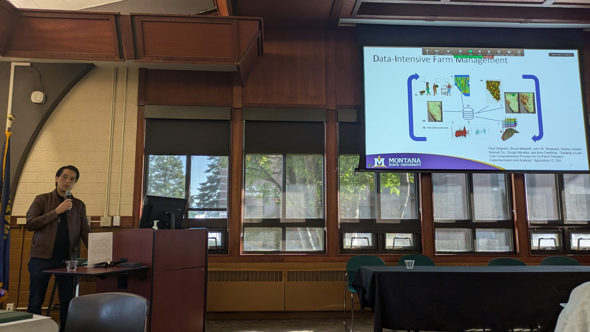
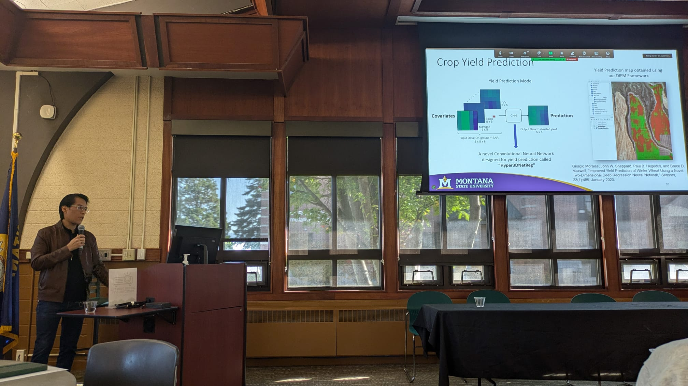

I was invited to speak at the Montana INBRE’s Data Science Core and Montana Technological University Symposium on 
Artificial Intelligence (AI) in Research and Higher Education! The symposium was set for October 14th, 2024 at the Montana Tech campus 
in Butte. 

During my talk, titled "AI for Precision Agriculture", I had the opportunity to delve into several works developed by 
the [Numerical Intelligent Systems Laboratory (NISL)](https://www.researchgate.net/lab/Numerical-Intelligent-Systems-Laboratory-John-Wilbur-Sheppard?ec=headerMenu&_tp=eyJjb250ZXh0Ijp7ImZpcnN0UGFnZSI6ImhvbWUiLCJwYWdlIjoiaG9tZSIsInBvc2l0aW9uIjoiZ2xvYmFsSGVhZGVyIn19).
These works correspond mainly to two exciting projects: 🚜 Data Intensive Farm Management (DIFM) and 🌾 Weed Classification Using Hyperspectral and Multispectral Imagery.

It was a fantastic experience to discuss these projects and share insights on how AI is transforming the agricultural landscape. A big thank you to Montana INBRE and Montana Tech for organizing this incredible event!

  <iframe src="https://docs.google.com/presentation/d/e/2PACX-1vQdZJmmpty2RfyG3IDdhKUHJo39IjYN2endQKNmLHbxC22D70PgjHV1hmDF4_Y3Lg/embed?start=false&loop=false&delayms=3000" frameborder="0" style="position: absolute; top: 0; left: 0; width: 100%; height: 100%;" allowfullscreen="true" mozallowfullscreen="true" webkitallowfullscreen="true"></iframe>

    

    

    

