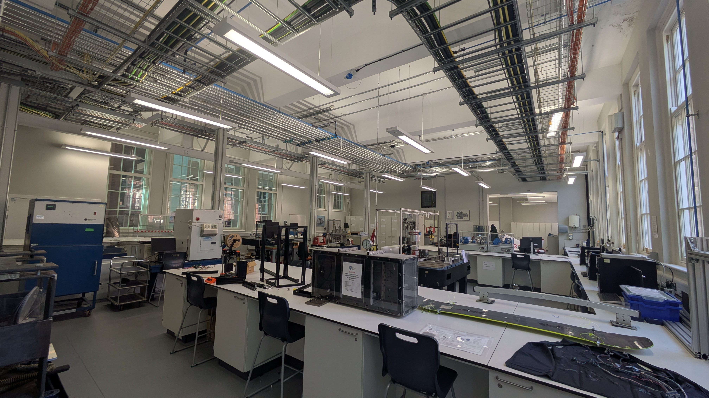
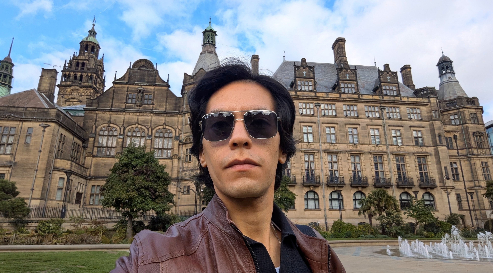

I had the pleasure of giving a seminar at [The University of Sheffield](https://sheffield.ac.uk/), where I talked about my work on symbolic regression/equation discovery, and their potential for identifying dynamical systems.

It was wonderful to meet the members of the [Dynamics Research Group (DRG)](https://drg.ac.uk/) and learn more about their work. I also got to visit their lab; as a computer scientist, it’s been a while since I’ve been in an actual lab! And of course, Sheffield is a beautiful city. Definitely enjoyed the visit!

Many thanks to [Max Champneys](https://sheffield.ac.uk/mac/people/research-staff/max-champneys) for the invitation, and to [Collins Ogbodo](https://collins-ogbodo.github.io/) for being such a great host. Really enjoyed the discussions and the opportunity to connect with the group!

<figure style="display: flex; flex-direction: column; align-items: center;">
    
    <figcaption style="text-align: center; margin-top: 5px; font-style: italic;">
        Dynamics Research Group Lab.
    </figcaption>
</figure>

<figure style="display: flex; flex-direction: column; align-items: center;">
    
    <figcaption style="text-align: center; margin-top: 5px; font-style: italic;">
        Peace Gardens.
    </figcaption>
</figure>

<figure style="display: flex; flex-direction: column; align-items: center;">
    
    <figcaption style="text-align: center; margin-top: 5px; font-style: italic;">
        Maida Vale.
    </figcaption>
</figure>
