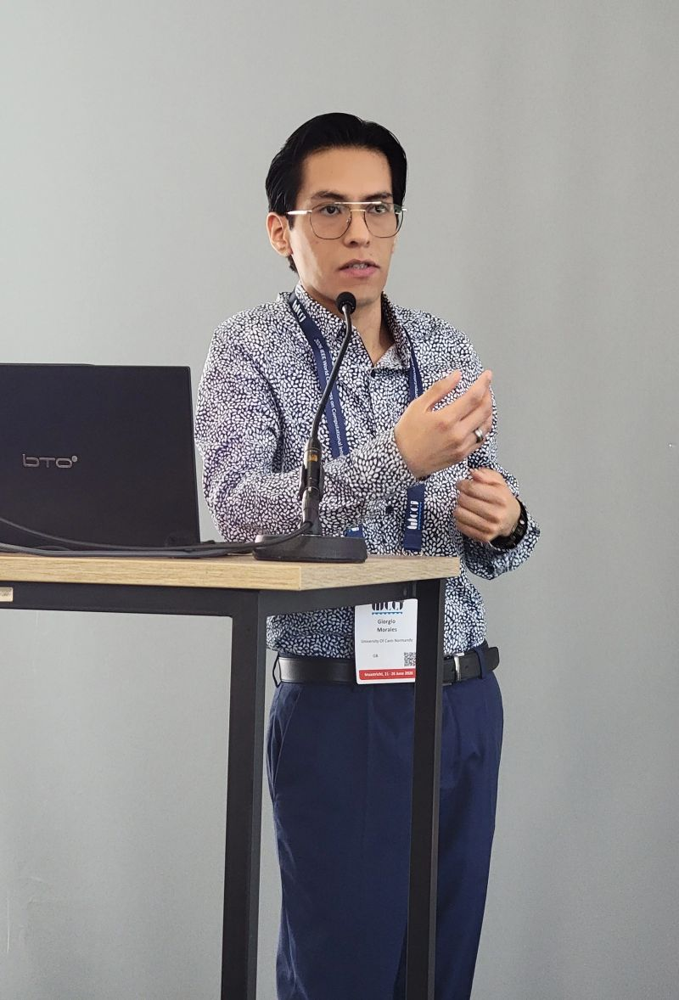
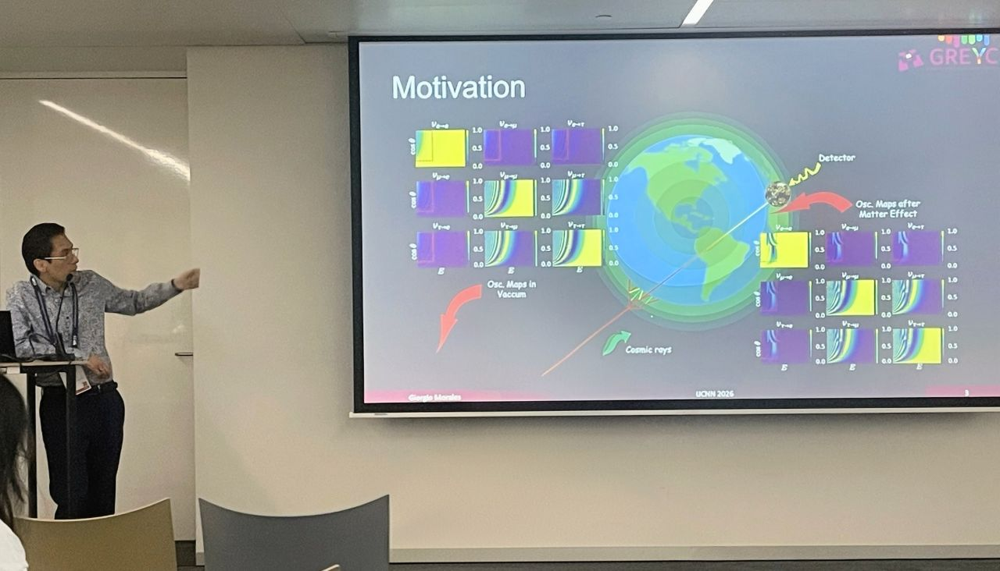

 I attended the 𝐖𝐨𝐫𝐥𝐝 𝐂𝐨𝐧𝐠𝐫𝐞𝐬𝐬 𝐨𝐧 𝐂𝐨𝐦𝐩𝐮𝐭𝐚𝐭𝐢𝐨𝐧𝐚𝐥 𝐈𝐧𝐭𝐞𝐥𝐥𝐢𝐠𝐞𝐧𝐜𝐞 (IEEE WCCI 2026) 🌍 in Maastricht, Netherlands, from 22 to 26 June. Monday 23 turned out to be a particularly hectic day, with two oral presentations covering quite different applications. 

📄At the 𝐈𝐧𝐭𝐞𝐫𝐧𝐚𝐭𝐢𝐨𝐧𝐚𝐥 𝐉𝐨𝐢𝐧𝐭 𝐂𝐨𝐧𝐟𝐞𝐫𝐞𝐧𝐜𝐞 𝐨𝐧 𝐍𝐞𝐮𝐫𝐚𝐥 𝐍𝐞𝐭𝐰𝐨𝐫𝐤𝐬 (𝐈𝐉𝐂𝐍𝐍 2026), I presented our paper ("Neutrino Oscillation Parameter Estimation Using Structured Hierarchical Transformers")[publication/morales-neutrino-2026], joint work with [Gregory Lehaut](https://scholar.google.com/citations?user=mS3cu1AAAAAJ&hl=fr), [Antonin Vacheret](https://inspirehep.net/authors/1023486), [Frederic Jurie](https://frederic-jurie.github.io/), and [Jalal Fadili](https://fadili.users.greyc.fr/Pub/bibtex/consult.php), from [Greyc](https://www.greyc.fr/) and [LPC Caen](https://www.lpc-caen.in2p3.fr/), France. 

📄I also gave a presentation at the 𝗪𝗼𝗿𝗸𝘀𝗵𝗼𝗽 𝗼𝗻 𝗦𝘆𝗺𝗯𝗼𝗹𝗶𝗰 𝗥𝗲𝗴𝗿𝗲𝘀𝘀𝗶𝗼𝗻 𝗮𝗻𝗱 𝗘𝗾𝘂𝗮𝘁𝗶𝗼𝗻 𝗗𝗶𝘀𝗰𝗼𝘃𝗲𝗿𝘆 (SymReg@WCCI 2026), which is part of the 𝗜𝗘𝗘𝗘 𝗖𝗼𝗻𝗴𝗿𝗲𝘀𝘀 𝗼𝗻 𝗘𝘃𝗼𝗹𝘂𝘁𝗶𝗼𝗻𝗮𝗿𝘆 𝗖𝗼𝗺𝗽𝘂𝘁𝗮𝘁𝗶𝗼𝗻 (𝗖𝗘𝗖): ("Learning Parametric Nitrogen Fertilizer Response Curves Using Neuro Symbolic Regression")[publication/morales-2026-symreg], coauthored with [Dr. John Sheppard](https://www.cs.montana.edu/sheppard/), from Montana State University-Bozeman. 

🤝 One of the highlights of the week was connecting with the Symbolic Regression community and learning about their latest developments. Many thanks to Gabriel Kronberger for organizing the SymReg workshop and bringing the community together.

✨Another highlight was catching up with Dr. John Sheppard. One of the perks of staying in academia is that you keep finding opportunities to meet your PhD advisor at conferences around the world.

Looking forward to seeing how these collaborations and research directions continue to evolve.

<figure style="display: flex; flex-direction: column; align-items: center;">
    
    <figcaption style="text-align: center; margin-top: 5px; font-style: italic;">
        Presentation @ WCCI SymReg Workshop.
    </figcaption>
</figure>

<figure style="display: flex; flex-direction: column; align-items: center;">
    
    <figcaption style="text-align: center; margin-top: 5px; font-style: italic;">
        Presentation @ WCCI Main Track.
    </figcaption>
</figure>

