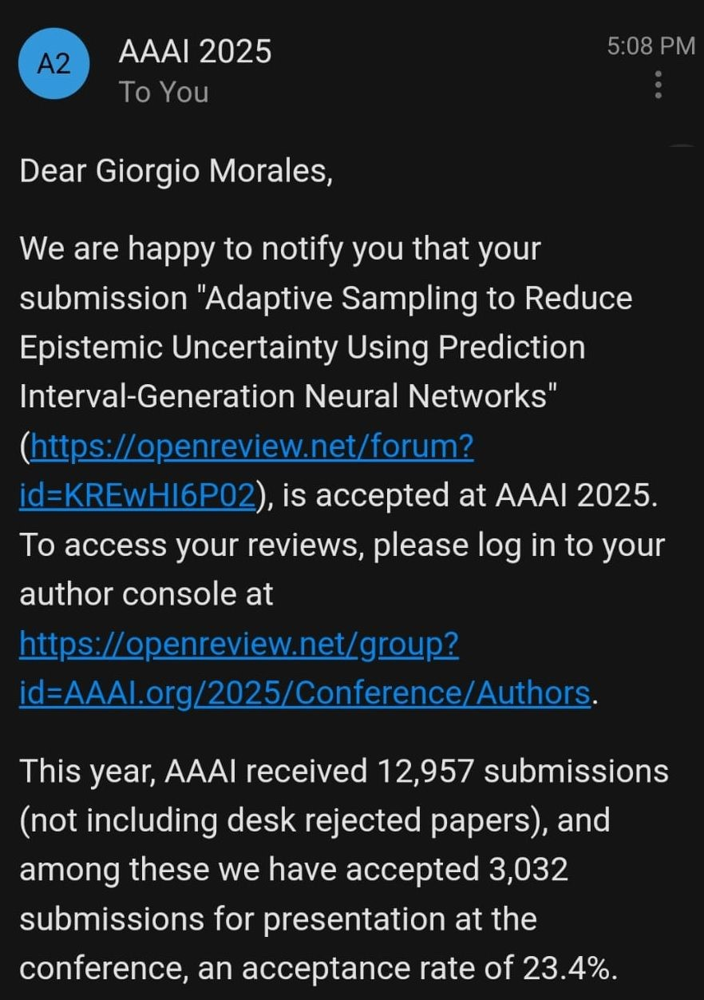

I am very proud to announce that our paper, "Adaptive Sampling to Reduce Epistemic Uncertainty Using Prediction 
Interval-Generation Neural Networks," co-authored with Dr. John Sheppard, has been accepted at the prestigious 
[Association for the Advancement of Artificial Intelligence (AAAI)](https://aaai.org/aaai-24-conference/save-the-date-aaai-25/) 2025 conference! 🎉

🌟Summary: In scientific and engineering fields, achieving accurate prediction models often requires extensive 
experimentation, which can be both costly and time-consuming. This paper introduces an adaptive sampling 
approach that reduces epistemic uncertainty by developing a metric derived from prediction interval-generation 
neural networks and a batch sampling strategy based on Gaussian processes.

Excited to showcase our work at one of the world's leading AI conferences! 🌍🤖 

    

