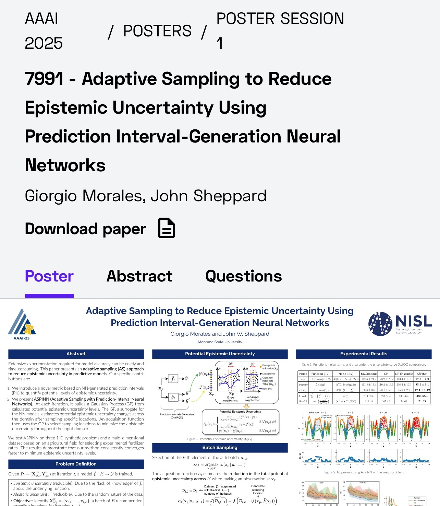
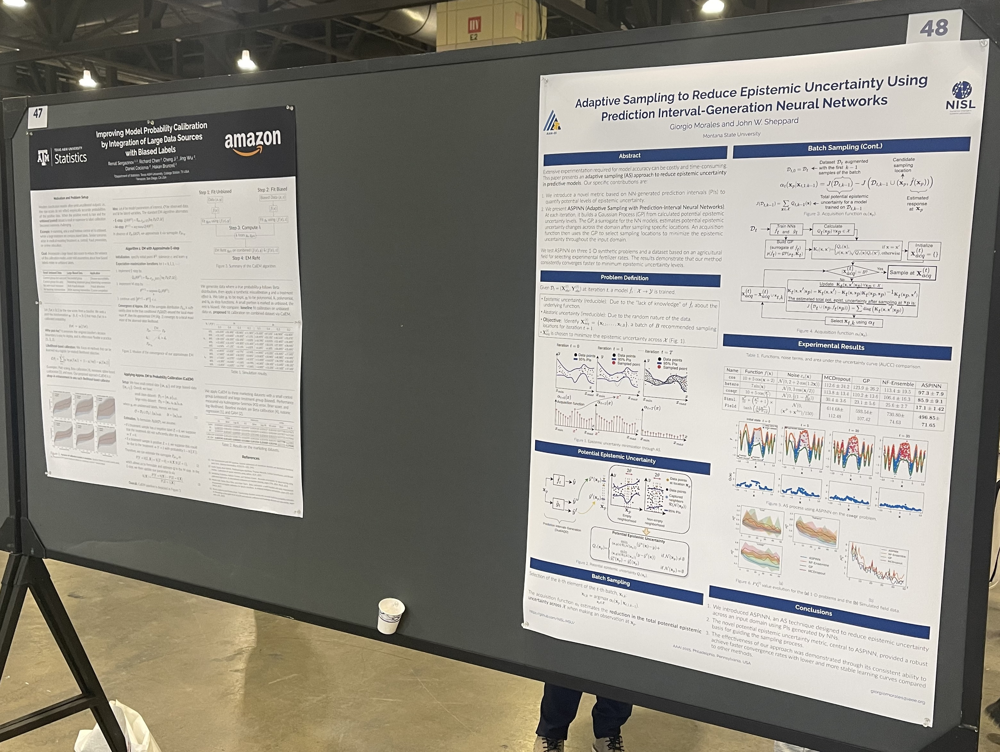

Our paper ["Adaptive Sampling to Reduce Epistemic Uncertainty Using Prediction Interval-Generation Neural Networks"](/publication/morales-aaai-2025)
was presented today at the Poster Session of AAAI's Main Track by Dr. John Sheppard in Philadelphia, US.
The paper was accepted at the AAAI Advancement of Artificial Intelligence 2025 conference.
Download the poster ["here"](/post/aaai-2025-presentation/AAAI_2025_poster.pdf).

    

    

