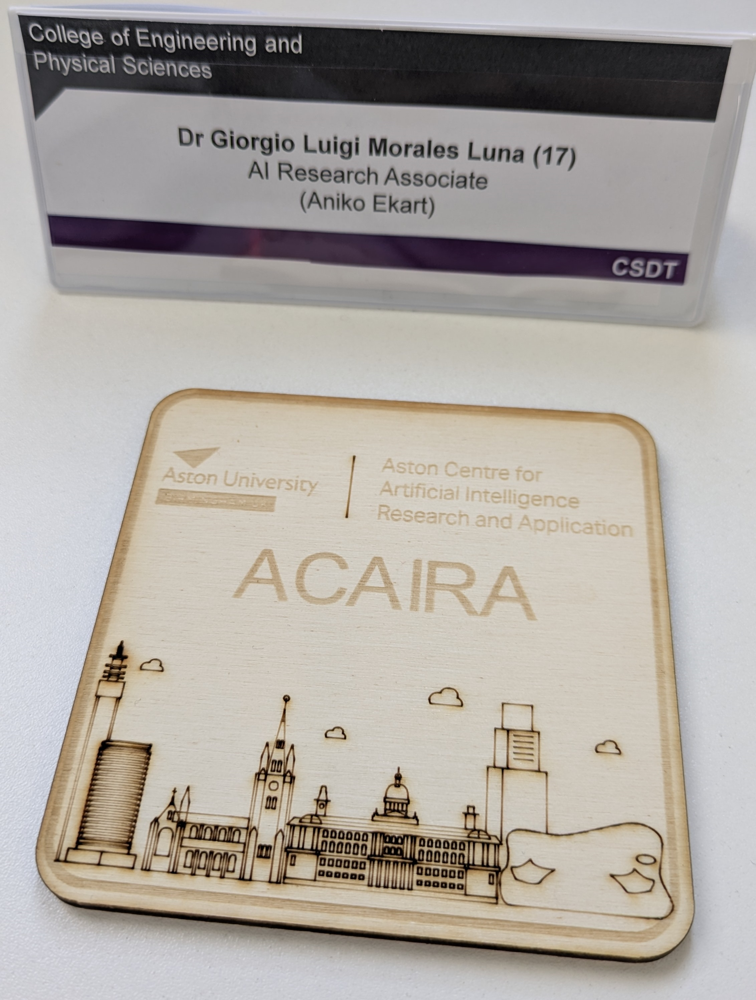
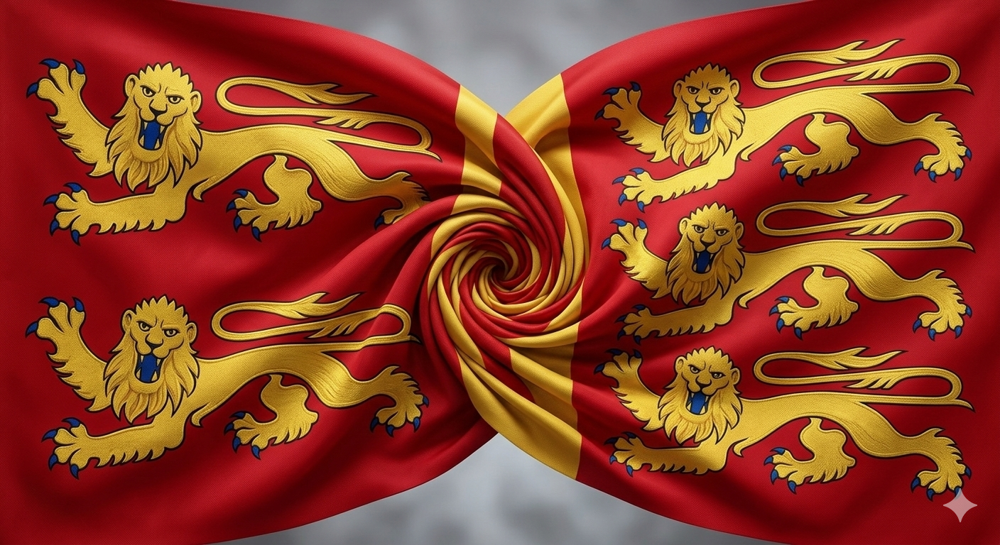

---
title: I've been awarded the Aston AI Fellowship 
summary: I moved to the UK and will begin a new position at Aston University
date: 2026-03-03
authors:
  - admin
tags:
  - News
  - Fellowship
  - Work update

featured: true

image:
  caption: 'My new workplace'
  focal_point: ""
  preview_only: false
--- 
I am excited to share that I was awarded the [Aston AI Fellowship](https://www.aston.ac.uk/research/ai-fellows) 
at [Aston University](https://www.aston.ac.uk/) in Birmingham, UK. 
This 3-year research fellowship supports high-impact AI solutions for global challenges 🎓. 

As part of this "Research Associate" position, I will develop my own research project that continues the core research questions on Neuro Symbolic Regression and Uncertainty Quantification from my PhD. 
The project is titled "GUIDE: Guided Uncertainty-aware Interactive Discovery of Equations".

I am joining a brilliant team at the [Aston Centre for Artificial Intelligence Research and Application (ACAIRA)](https://www.aston.ac.uk/research/eps/acaira), 
led by [Dr. Aniko Ekart](https://research.aston.ac.uk/en/persons/aniko-ek%C3%A1rt/). 
As project lead, I will be very happy to explore potential collaborations across the UK and Europe on these topics, 
especially at a time when Interpretable and Explainable AI is gaining so much relevance.

And finally, just like William the Conqueror, we left Normandy, crossed the English Channel, and are ready to conquer new lands!

    

<figure style="display: flex; flex-direction: column; align-items: center;">
    
    <figcaption style="text-align: center; margin-top: 5px; font-style: italic;">
        I moved from Normandy, France to Birmingham, UK. Left: Normandy flag. Right: Royal Banner of England.
    </figcaption>
</figure>