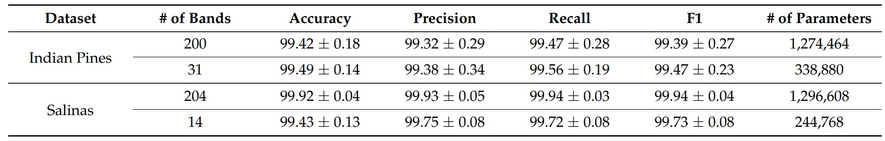
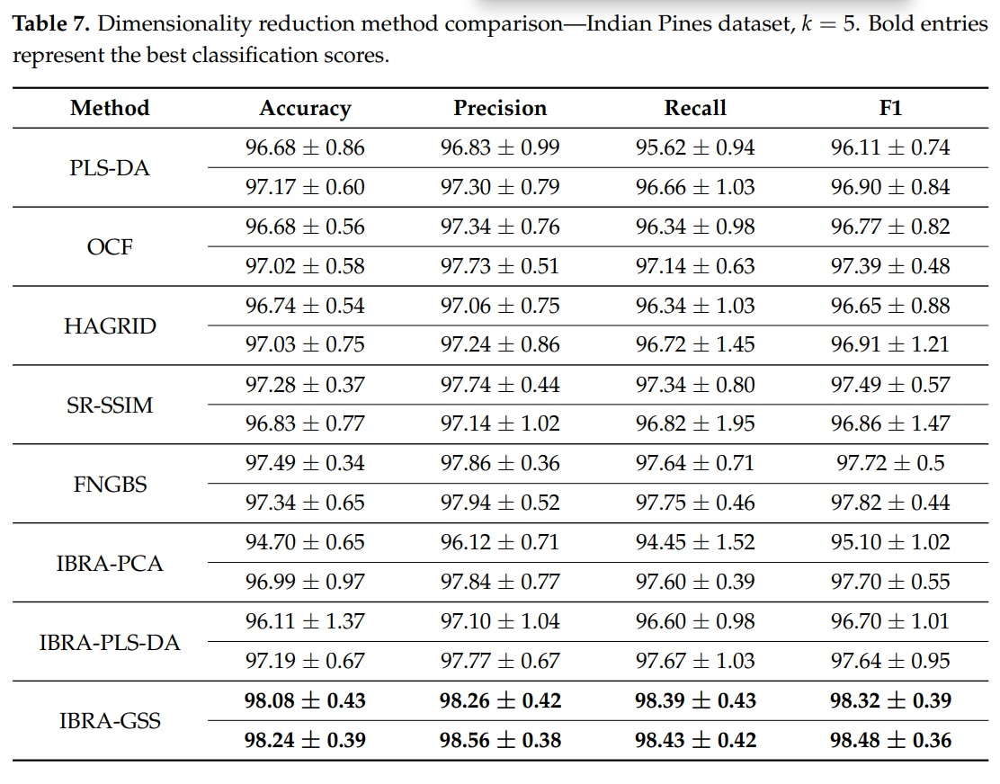
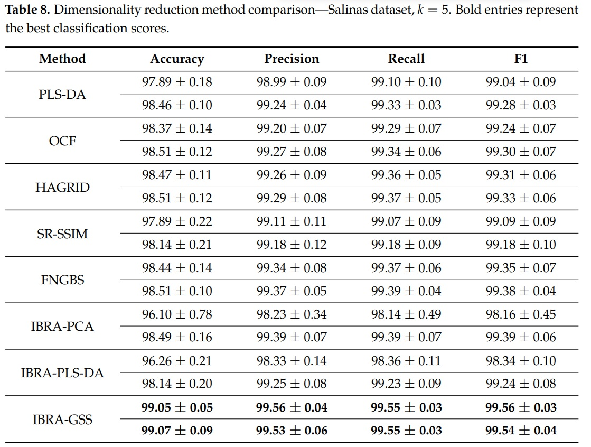

In this post, I will report the best five spectral bands for the Indian Pines (IP) and Salinas (SA) hyperspectral datasets obtained by our hybrid-band selection method presented in our paper "[Hyperspectral Dimensionality Reduction based on Inter-Band Redundancy Analysis and Greedy Spectral Selection](https://www.researchgate.net/publication/354578178_Hyperspectral_Dimensionality_Reduction_Based_on_Inter-Band_Redundancy_Analysis_and_Greedy_Spectral_Selection)". In addition, **I will provide code in Python** to demonstrate the improvements in classification performance in comparison to other five band selection methods.

## Background

Hyperspectral imaging systems have the ability to capture good spatial resolution while also capturing rich spectral content. However, the spectrally-dense data cubes captured by HSI systems often have large file sizes, high data density, and introduce additional computational complexity. Taken together, these factors present computational limitations when post-processing imagery and storing data products. In applications where spectral bands are known a priori, the additional complexity and cost introduced by HSI systems may be unnecessary. Yet, in many applications, salient wavelengths are not known a priori. 

Though HSI systems capture rich spectral data, determination of the most relevant wavelengths in a data cube is a challenging task. Successful determination of salient wavelengths within a hyperspectral data cube would provide several distinct benefits. If using a band selection method, processing and storage requirements can be relaxed as only relevant spectral bands are stored and processed. When using feature extraction methods, all spectral bands are stored, but classification accuracy can be increased. Regardless of which method is used, identification of relevant spectral bands provides a means of developing multispectral imagers in place of hyperspectral imagers for a given classification task.

## Selected Bands for Indian Pines and Salinas Datasets

In our paper, we proposed a filter-based method called interband redundancy analysis (IBRA) that works as a preselection method to remove redundant bands and reduce the search space dramatically. Furthermore, we presented a two-step band selection method that first applies IBRA to obtain a reduced set of candidate bands and then selects the desired number of bands using a wrapper-based method called greedy spectral selection (GSS). 

It is worth noting that IBRA considers that two bands are colinear (correlated) is the Variance Inflation Factor (VIF) is less than a threshold $$\theta$$. Thus, our IBRA-GSS selection method tests different threshold values ($$\theta \in [5, 12]$$) and selects the one that gives us the best separability results. The following table gives the number of preselected bands for the IP and SA datasets when using
IBRA with a VIF threshold of 10 ($$\theta = 10$$); it also gives the average performance for four
metrics and corresponding standard deviations (we applied $$5 \times 2$$ - fold stratified cross-validation to train and evaluate all networks) using a convolutional neural network classifier (called **Hyper3DNetLite**) when training on the full hyperspectral spectrum and only the preselected bands:

<div style="display: flex; justify-content: center;">
    
</div>

For the IP dataset, the best results were obtained using a VIF threshold of ten ($$\theta=10$$) and the wavelength of the selected bands were $$[498.3, 626.9, 706.2, 821.8, 1023.7]$$ nm. (i.e., with band indices $$[11, 25, 34, 39, 67]$$). The following table shows the performance using IBRA-GSS on the IP dataset in comparison to other band selection methods.

<div style="display: flex; justify-content: center;">
    
</div>

For the SA dataset, the best classification performance was obtained using a VIF threshold of $\theta=8$. The wavelength of the selected bands were $$[731.83, 950.54,1159.73, 1254.82, 2044.73]$$ (nm.), which correspond to the indices $$[37, 60, 82, 92, 175]$$ of the corrected SA dataset after discarding the 20 water absorption bands. The following table shows the performance using IBRA-GSS on the SA dataset in comparison to other band selection methods.

<div style="display: flex; justify-content: center;">
    
</div>

## Python Demonstration

Here, we will provide some Python code to compare the classification performance obtained by the set of bands selected by our IBRA-GSS method in comparison of sets of bands selected by other methods. For the sake of brevity, I am providing only a portion of the code. However, the complete interactive demonstration code is available at the following link: 

[](https://colab.research.google.com/github/GiorgioMorales/HSI-BandSelection/blob/master/IP_SA_Clasification-Demo.ipynb)

First, let's download our datasets:

```python
# Download Indian Pines dataset
!wget https://github.com/GiorgioMorales/HSI-BandSelection/raw/master/Data/Indian_pines_corrected.mat
!wget https://github.com/GiorgioMorales/HSI-BandSelection/raw/master/Data/Indian_pines_gt.mat

# Download Salinas dataset
!wget https://github.com/GiorgioMorales/HSI-BandSelection/raw/master/Data/Salinas_corrected.mat
!wget https://github.com/GiorgioMorales/HSI-BandSelection/raw/master/Data/Salinas_gt.mat
```

Now, we define some functions used to pre-process the data before loading it. Note that **we're splitting 50% of our datasets for training and 50% for validation**.

```python
def loadata(name):
    data_path = os.path.join(os.getcwd(), '')
    if name == 'IP':
        dat = sio.loadmat('Indian_pines_corrected.mat', verify_compressed_data_integrity=False)['indian_pines_corrected']
        label = sio.loadmat(os.path.join(data_path, 'Indian_pines_gt.mat'), verify_compressed_data_integrity=False)['indian_pines_gt']
        return dat, label
    elif name == 'SA':
        dat = sio.loadmat(os.path.join(data_path, 'Salinas_corrected.mat'))['salinas_corrected']
        label = sio.loadmat(os.path.join(data_path, 'Salinas_gt.mat'))['salinas_gt']
        return dat, label


def padWithZeros(Xc, margin=2):
    newX = np.zeros((Xc.shape[0] + 2 * margin, Xc.shape[1] + 2 * margin, Xc.shape[2]))
    x_offset = margin
    y_offset = margin
    newX[x_offset:Xc.shape[0] + x_offset, y_offset:Xc.shape[1] + y_offset, :] = Xc
    return newX


def createImageCubes(Xc, yc, window=5, removeZeroLabels=True):
    margin = int((window - 1) / 2)
    zeroPaddedX = padWithZeros(Xc, margin=margin)
    # split patches
    patchesData = np.zeros((Xc.shape[0] * Xc.shape[1], window, window, Xc.shape[2]))
    patchesLabels = np.zeros((Xc.shape[0] * Xc.shape[1]))
    patchIndex = 0
    for r in range(margin, zeroPaddedX.shape[0] - margin):
        for c in range(margin, zeroPaddedX.shape[1] - margin):
            patch = zeroPaddedX[r - margin:r + margin + 1, c - margin:c + margin + 1]
            patchesData[patchIndex, :, :, :] = patch
            patchesLabels[patchIndex] = yc[r - margin, c - margin]
            patchIndex = patchIndex + 1
    if removeZeroLabels:
        patchesData = patchesData[patchesLabels > 0, :, :, :]
        patchesLabels = patchesLabels[patchesLabels > 0]
        patchesLabels -= 1
    return patchesData, patchesLabels

# Load and pre-process the data
data = 'IP'  # 'IP': Indian Pines, 'SA': Salinas 
trainx, train_y = loadata(data)
trainx, train_y = createImageCubes(trainx, train_y, window=5)

# Reshape as a 4-D TENSOR
trainx = np.reshape(trainx, (trainx.shape[0], trainx.shape[1], trainx.shape[2],
                             trainx.shape[3], 1))

# Shuffle dataset and reduce dataset size
np.random.seed(seed=7)  # Initialize seed to get reproducible results
ind = [i for i in range(trainx.shape[0])]
np.random.shuffle(ind)
trainx = trainx[ind][:, :, :, :, :]
train_y = train_y[ind][:]

# Transpose dimensions to fit Pytorch order
trainx = trainx.transpose((0, 4, 3, 1, 2))

# Separate 50% of the dataset for training
train_ind, val_ind = train_test_split(range(len(trainx)), test_size=0.50, random_state=7)
trainX = np.array(trainx[train_ind])
trainY = np.array(train_y[train_ind])
valX = np.array(trainx[val_ind])
valY = np.array(train_y[val_ind])
```

Now we define a class called **Hyper3DNetLite** used to create the CNN classifier we will use to train and validate our models. Preliminarily, we experimented with other types of classifiers to use in the GSS process; specifically, support vector machines, random forests, and feedforward neural networks. However,
these approaches showed slow convergence rates and poor classification performance in comparison to our CNN, despite being a more complex model

```python
from abc import ABC

import torch.nn as nn
from torch import reshape

def weight_reset(m):
    """Reset model weights before training a model with a new selection of bands"""
    if isinstance(m, nn.Conv2d) or isinstance(m, nn.Conv3d) or isinstance(m, nn.Linear):
        m.reset_parameters()

class Hyper3DNetLite(nn.Module, ABC):
    def __init__(self, img_shape=(1, 50, 25, 25), classes=2, data='Kochia'):
        super(Hyper3DNetLite, self).__init__()
        if data == 'Kochia' or data == 'Avocado':
            stride = 2
            out = 7
        else:
            stride = 1
            out = 5
        self.classes = classes
        self.img_shape = img_shape

        self.conv_layer1 = nn.Sequential(nn.Conv3d(in_channels=img_shape[0], out_channels=16, kernel_size=3, padding=1),
                                         nn.ReLU(), nn.BatchNorm3d(16))
        self.conv_layer2 = nn.Sequential(nn.Conv3d(in_channels=16, out_channels=16, kernel_size=3, padding=1),
                                         nn.ReLU(), nn.BatchNorm3d(16))
        self.sepconv1 = nn.Sequential(nn.Conv2d(in_channels=16 * img_shape[1], out_channels=16 * img_shape[1],
                                                kernel_size=5, padding=2, groups=16 * img_shape[1]), nn.ReLU(),
                                      nn.Conv2d(in_channels=16 * img_shape[1], out_channels=320,
                                                kernel_size=1, padding=0), nn.ReLU(), nn.BatchNorm2d(320))
        self.sepconv2 = nn.Sequential(nn.Conv2d(in_channels=320, out_channels=320,
                                                kernel_size=3, padding=1, stride=stride, groups=320), nn.ReLU(),
                                      nn.Conv2d(in_channels=320, out_channels=256,
                                                kernel_size=1, padding=0), nn.ReLU(), nn.BatchNorm2d(256))
        self.sepconv3 = nn.Sequential(nn.Conv2d(in_channels=256, out_channels=256,
                                                kernel_size=3, padding=1, stride=stride, groups=256), nn.ReLU(),
                                      nn.Conv2d(in_channels=256, out_channels=256,
                                                kernel_size=1, padding=0), nn.ReLU(), nn.BatchNorm2d(256))
        self.average = nn.AvgPool2d(kernel_size=out)

        if classes == 2:
            self.fc1 = nn.Linear(256, 1)
        else:
            self.fc1 = nn.Linear(256, self.classes)

    def forward(self, x):

        # 3D Feature extractor
        x = self.conv_layer1(x)
        x = self.conv_layer2(x)
        # Reshape 3D-2D
        x = reshape(x, (x.shape[0], self.img_shape[1] * 16, self.img_shape[2], self.img_shape[3]))
        # 2D Spatial encoder
        x = self.sepconv1(x)
        x = self.sepconv2(x)
        x = self.sepconv3(x)
        # Global Average Pooling
        x = self.average(x)
        x = reshape(x, (x.shape[0], x.shape[1]))
        if self.classes == 2:
            x = self.fc1(x)
        else:
            x = self.fc1(x)
        return x
```

Finally, let's skip some steps and jump directly to the training and validation steps (again, the full implementation can be found in the Google Colab script). In the following code, note that we are normalizing (we apply z-score normalization) the training set using the $$\texttt{normalize()}$$ function; then, we apply the same transformation to the validation set using the $$\texttt{applynormalize()}$$ function, which uses the calculated mean and standard deviation values from the training set. Then, we create an object from the $$\texttt{CNNTrainer}$$ class, which contains the necessary methods to train ($$\texttt{trainFold()}$$), validate ($$\texttt{evaluateFold()}$$), and initialize a CNN model ($$\texttt{defineModel()}$$). Thus, in the following code **we train a Hyper3DNetLite model for the Indian Pines dataset** using a training set that selects the following spectral band indexes: [11, 25, 34, 39, 67], **which were selected by our IBRA-GSS band selection method**.   

```python
indexes = [11, 25, 34, 39, 67]  # For SA: [37, 60, 82, 92, 175]
train_X_selected = select(trainX, indexes)
val_X_selected = select(valX, indexes)

# Normalize using the training set
train_X_selected, means, stds = normalize(train_X_selected)
# Apply the same normalization to the validation set
val_X_selected = applynormalize(val_X_selected, means, stds)

# Initialize model and train (USE GPU!: Runtime -> Change runtime type)
model = CNNTrainer()
model.defineModel(nbands=5, windowSize=5, train_y=trainY)
model.trainFold(trainx=train_X_selected, trainy=trainY, valx=val_X_selected, valy=valY, 
                        batch_size=128, epochs=50, filepath="temp_model", printProcess=False)  # Set printProcess=True to see the training process 

# Validate
model.loadModel("temp_model")
ytest, ypred = model.evaluateFold(valx=val_X_selected, valy=valY, batch_size=128)
correct_pred = (np.array(ypred) == ytest).astype(float)
oa = correct_pred.sum() / len(correct_pred) * 100
prec, rec, f1, support = precision_recall_fscore_support(ytest, ypred, average='macro')

print("Accuracy = " + str(oa))
print("Precision = " + str(prec))
print("Recall = " + str(rec))
print("F1 = " + str(f1))

# Reset weights
model.model.network.apply(weight_reset)
```
```
>>
Training model.....
Accuracy = 98.18536585365854
Precision = 0.9833378649246366
Recall = 0.9805571561269105
F1 = 0.9817216848978283
```

If we train a model that uses the same Hyper3DNetLite architecture using the bands selected by the [Fast Neighborhood Grouping Method for Hyperspectral Band Selection (FNGBS) method](https://github.com/qianngli/FNGBS) ([28, 70, 92, 107, 129]), we obtain:

```python
indexes = [28, 70, 92, 107, 129]  # For SA: [16, 31, 113, 132, 175]
train_X_selected = select(trainX, indexes)
val_X_selected = select(valX, indexes)

... (repeat the training and validation code shown above)
```
```
>>

Training model.....
Accuracy = 96.9560975609756
Precision = 0.9486142406432961
Recall = 0.9633240193810757
F1 = 0.9549830786866147
```


If we train a model that uses the bands selected by the [Similarity-Based Ranking (SRSSIM) method](https://ieeexplore.ieee.org/document/9324974) ([28, 52, 91, 104, 121]), we obtain:

```python
indexes = [28, 52, 91, 104, 121]  # For SA: [5, 47, 61, 81, 201]
train_X_selected = select(trainX, indexes)
val_X_selected = select(valX, indexes)

... (repeat the training and validation code shown above)
```
```
>>

Training model.....
Accuracy = 97.26829268292683
Precision = 0.9606307317052267
Recall = 0.9572251907795821
F1 = 0.9585275998455447
```


If we train a model that uses the bands selected by the [Optimal Clustering Framework (OCF) method](https://ieeexplore.ieee.org/document/8356741/) ([16, 28, 50, 67, 90]), we obtain:

```python
indexes = [16, 28, 50, 67, 90]  # For SA: [34, 45, 58, 93, 120]
train_X_selected = select(trainX, indexes)
val_X_selected = select(valX, indexes)

... (repeat the training and validation code shown above)
```
```
>>

Training model.....
Accuracy = 96.58536585365853
Precision = 0.9605385147207325
Recall = 0.9617955690283178
F1 = 0.9607409243482415
```


If we train a model that uses the bands selected by the [Histogram Assisted Genetic Algorithm for Reduction in Dimensionality (HAGRID) method](https://www.researchgate.net/publication/334216691_Using_a_genetic_algorithm_with_histogram-based_feature_selection_in_hyperspectral_image_classification) ([17, 31, 55, 75, 119]]), we obtain:

```python
indexes = [17, 31, 55, 75, 119]  # For SA: [13, 20, 31, 44, 84]
train_X_selected = select(trainX, indexes)
val_X_selected = select(valX, indexes)

... (repeat the training and validation code shown above)
```
```
>>

Training model.....
Accuracy = 96.46829268292683
Precision = 0.9612188059575583
Recall = 0.9577183658032549
F1 = 0.9585461002239718
```

From these results, it is easy to see that our **IBRA-GSS method yields the best selection of bands for the Indian Pines dataset**. You can modify the code in Google Colab and use the SA dataset instead to verify that **IBRA-GSS yields the best selection of bands for the SA dataset as well**. In order to demonstrate that these improvements are statistically significant, we can perform $$5 \times 2$$ cross-validation, as we did in the tables shown in the previous section.

## Citation

If you want to use the results or the code provided in this post, please cite the following article:

```
@article{hsiselectionjournal,
  AUTHOR = {Morales, Giorgio and Sheppard, John W. and Logan, Riley D. and Shaw, Joseph A.},
  TITLE = {Hyperspectral Dimensionality Reduction Based on Inter-Band Redundancy Analysis and Greedy Spectral Selection},
  JOURNAL = {Remote Sensing},
  VOLUME = {13},
  YEAR = {2021},
  NUMBER = {18},
  ARTICLE-NUMBER = {3649},
  URL = {https://www.mdpi.com/2072-4292/13/18/3649},
  ISSN = {2072-4292},
  DOI = {10.3390/rs13183649}
```
