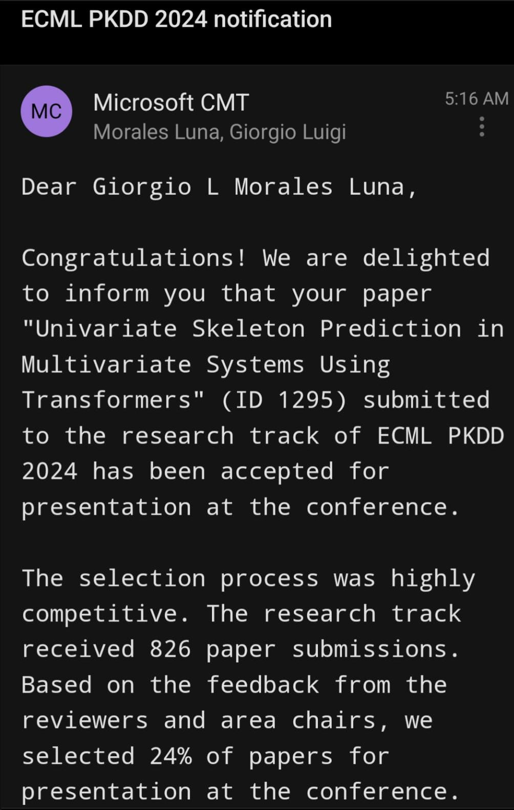

I am thrilled to announce that our paper ["Univariate skeleton prediction in multivariate systems
using transformers,"](/publication/morales-univariate-2024) co-authored with Dr. John Sheppard, has been accepted for presentation at the European 
Conference on Machine Learning and Principles and Practice of Knowledge Discovery in Databases 
([ECML-PKDD 2024](https://ecmlpkdd.org/2024/program-accepted-papers-research-track/)), to be held in Lithuania in September.

We propose an explainable neural symbolic regression method that generates univariate symbolic 
skeletons that aim to explain how each variable influences the response of a multivariate system. 
This method is one of the main components of my dissertation proposal, titled 
"Decomposable Symbolic Regression Using Transformers and Neural Network-Assisted Genetic Algorithms." 

    

