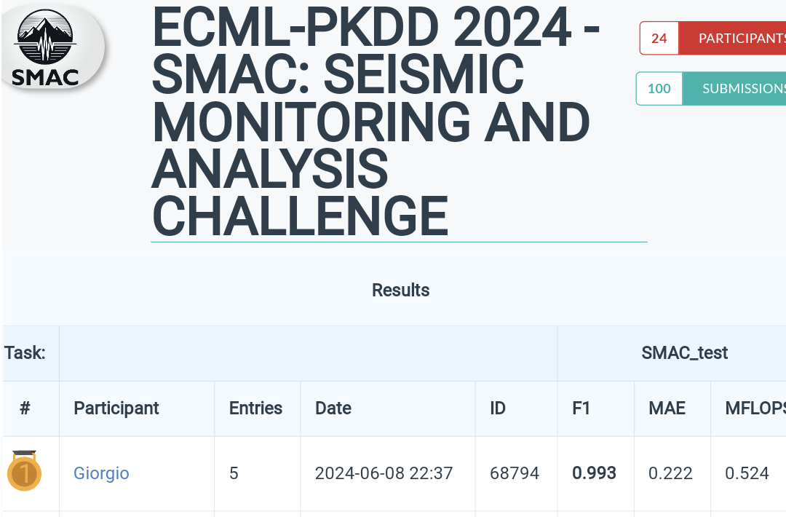

🌟 Exciting News! 🌟

I am thrilled to share that the [European Conference on Machine Learning and 
Principles and Practice of Knowledge Discovery in Databases](https://ecmlpkdd.org/2024/program-discovery-challenge/)
is hosting some incredible challenges this year, and I had the amazing opportunity to participate in one of them!

🚀 One of the standout competitions is the Seismic Monitoring and Analysis Challenge (SMAC):

> <blockquote style="font-style: italic; ;">
> "The continuously growing amount of Satellite data has opened numerous research avenues into exciting computer vision based applications. In this context, we propose the SMAC challenge, an Earth Observation challenge that aims to identify and measure earthquakes using satellite imagery. More specifically, the proposed challenge is a classification and regression challenge that, given the satellite imagery, aims to identify affected areas and the strength of the events. Additionally, this challenge will pose an extra evaluation of resource consumption to propose the most scalable solutions possible. We propose this challenge to foster discussions and further collaborations between researchers and first responders involved in the remote sensing domain to tackle problems related to hazard management and their environmental impact."
> </blockquote>

🔥 I'm beyond excited to announce that I won FIRST PLACE in this competition! 🏆 This achievement comes 
with a free conference registration and the honor of being a co-author on the challenge paper.

Stay tuned for more updates!

    

