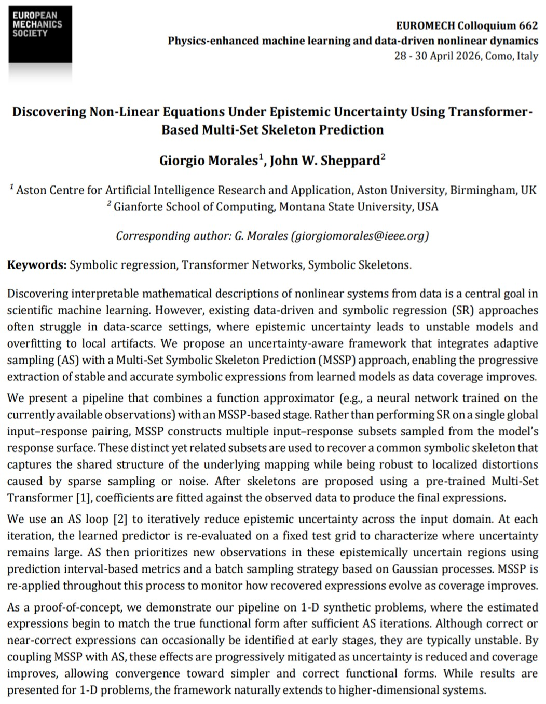

🚀 Heading back to Italy for the Euromech Colloquium 662!

I will be attending and presenting part of my research at the [Euromech Colloquium: "Physics-enhanced machine learning and data-driven nonlinear dynamics"](https://662.euromech.org/welcome-to-the-physics-enhanced-machine-learning-and-data-driven-nonlinear-dynamics/) in the beautiful Como, Italy.

The event, chaired by [Alice Cicirello](https://www.eng.cam.ac.uk/profiles/ac685) (University of Cambridge), brings together a fantastic European community working at the intersection of physics, mechanics, and AI. I’m really looking forward to getting involved in discussions on data-driven discovery.

📊 My Presentation: "Discovering Non-Linear Equations Under Epistemic Uncertainty Using Transformer-Based Multi-Set Skeleton Prediction," co-authored with Dr. John Sheppard 📅 Date: April 29 🕒 Time: 1:30 PM

🤝 Let’s Connect! If you are attending the colloquium or if your work involves symbolic regression, physics-informed ML, or their applications, I’d love to chat. Whether it's during a coffee break in Como or a virtual follow-up, let’s explore potential collaborations and ideas.

Check out the full programme and book of abstracts here: 🔗https://662.euromech.org/tentative-programme/

    

