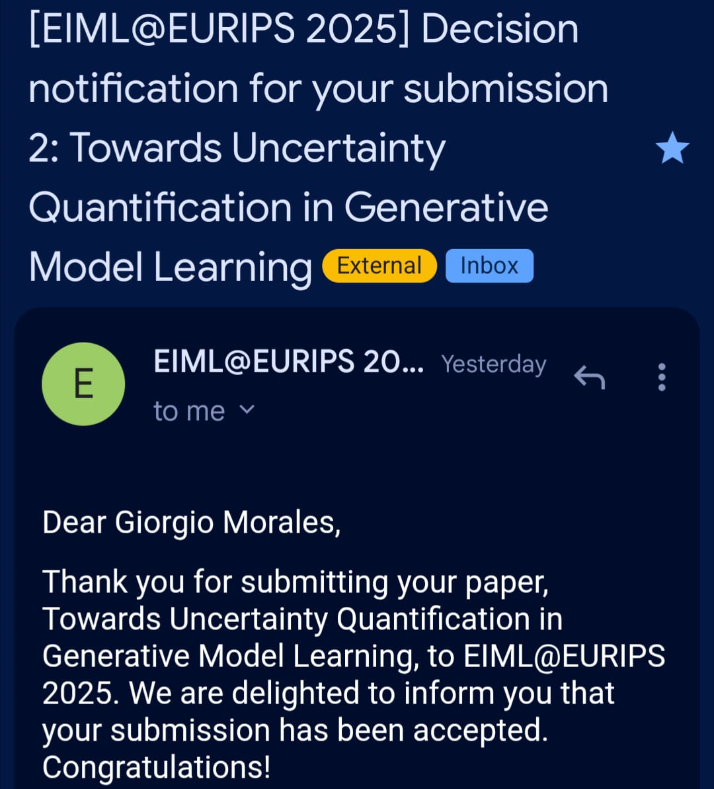
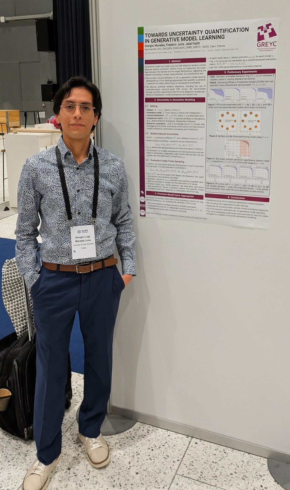
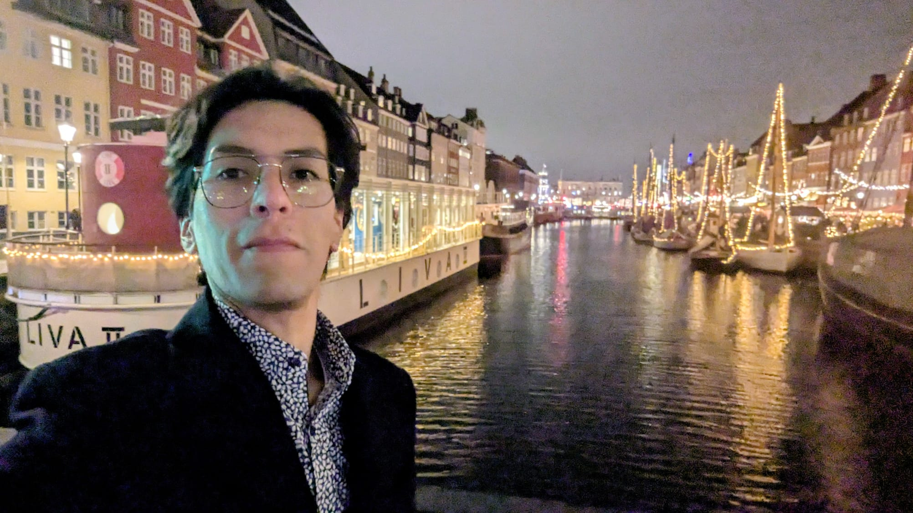

Our paper, "Towards Uncertainty Quantification in Generative Model Learning"
, co-authored with Dr. Frédéric Jurie and Dr. Jalal Fadili, has been accepted for presentation at the Epistemic 
Intelligence in Machine Learning Workshop ([EIML@EurIPS](https://sites.google.com/view/eiml-eurips2025)) in Copenhagen, Denmark! 🎉

I am honored to participate in the first-ever edition of [EurIPS](https://eurips.cc/), which marks an important milestone in 
making top-tier AI conferences, such as NeurIPS, more accessible. I strongly believe this new format is a necessary first step toward 
democratizing participation, strengthening the European research community, and reducing our collective carbon 
footprint by minimizing unnecessary transatlantic travel.

🔗 Read the paper here: [https://arxiv.org/abs/2511.10710](https://arxiv.org/abs/2511.10710)

🌟 Summary: Generative models are becoming increasingly prominent across diverse domains, yet their reliability remains 
a major challenge. In this work, we formalize the problem of uncertainty quantification in generative model learning, 
discussing research directions to measure epistemic uncertainty beyond distributional similarity metrics. 
Our preliminary experiments demonstrate how ensemble-based and aggregated precision-recall curves can reveal important 
insights into model approximation uncertainty.

    

<figure style="display: flex; flex-direction: column; align-items: center;">
    
    <figcaption style="text-align: center; margin-top: 5px; font-style: italic;">
        Poster presentation. EIML@EurIPS 2025.
    </figcaption>
</figure>

<figure style="display: flex; flex-direction: column; align-items: center;">
    
    <figcaption style="text-align: center; margin-top: 5px; font-style: italic;">
        Nyhavn, Copenhagen.
    </figcaption>
</figure>