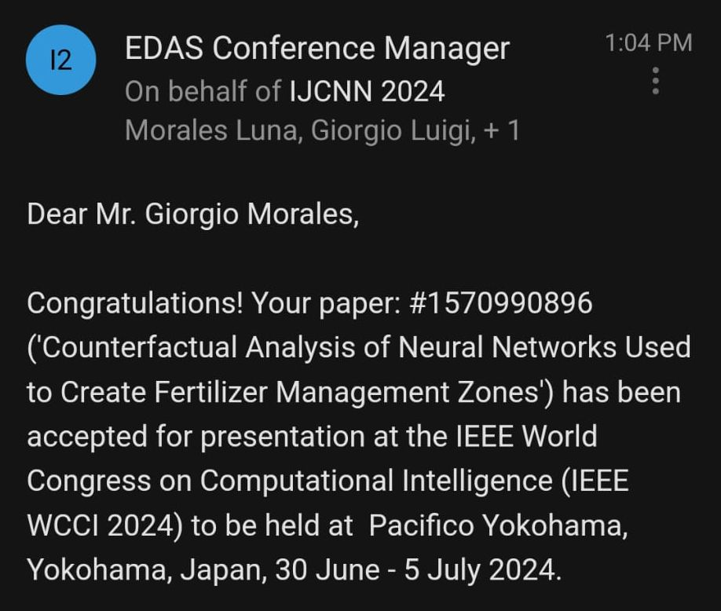

Glad to announce that our paper ["Counterfactual Analysis of Neural Networks Used to Create 
Fertilizer Management Zones,"](/publication/morales-counterfactual-2024) co-authored with Dr. John Sheppard, has been accepted for 
oral presentation at the International Joint Conference on Neural Networks (IJCNN 2024) as 
part of the IEEE World Congress on Computational Intelligence ([WCCI 2024](https://2024.ieeewcci.org/)) to be held in Yokohama 
in Japan. 

    

