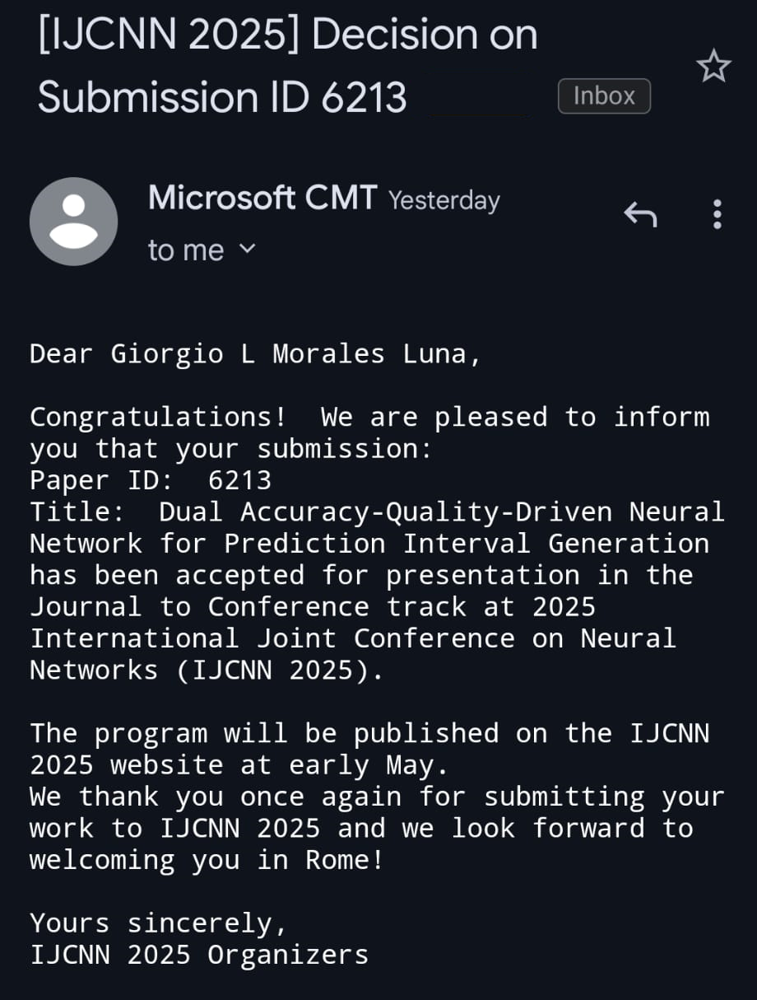

My journal-to-conference (J2C) submission to IJCNN 2025 has been accepted and it will be presented in Rome in July 🇮🇹🏛️! 
The J2C modality at IJCNN allows authors of recently published, high-impact journal papers to present 
their work at the conference, provided the paper was published within two years of the conference date 
and appears in selected journals such as IEEE Transactions on Neural Networks and Learning Systems (TNNLS).

🌟 My accepted work, titled ["Dual Accuracy-Quality-Driven Neural Network for Prediction Interval Generation,"](/publication/morales-dual-2023) 
and accepted in IEEE TNNLS in 2023, 
introduces **DualAQD**, a training strategy for neural networks that not only produces point estimates of a 
target variable but also generates high-quality prediction intervals (PIs). 
These PIs capture both aleatoric (data-driven) and epistemic (model-based) uncertainties by training 
two companion neural networks: one estimating the target and another estimating the bounds of the 
corresponding PI. The model is optimized via a dual-objective loss function that encourages narrow 
intervals with high probability coverage.

    

