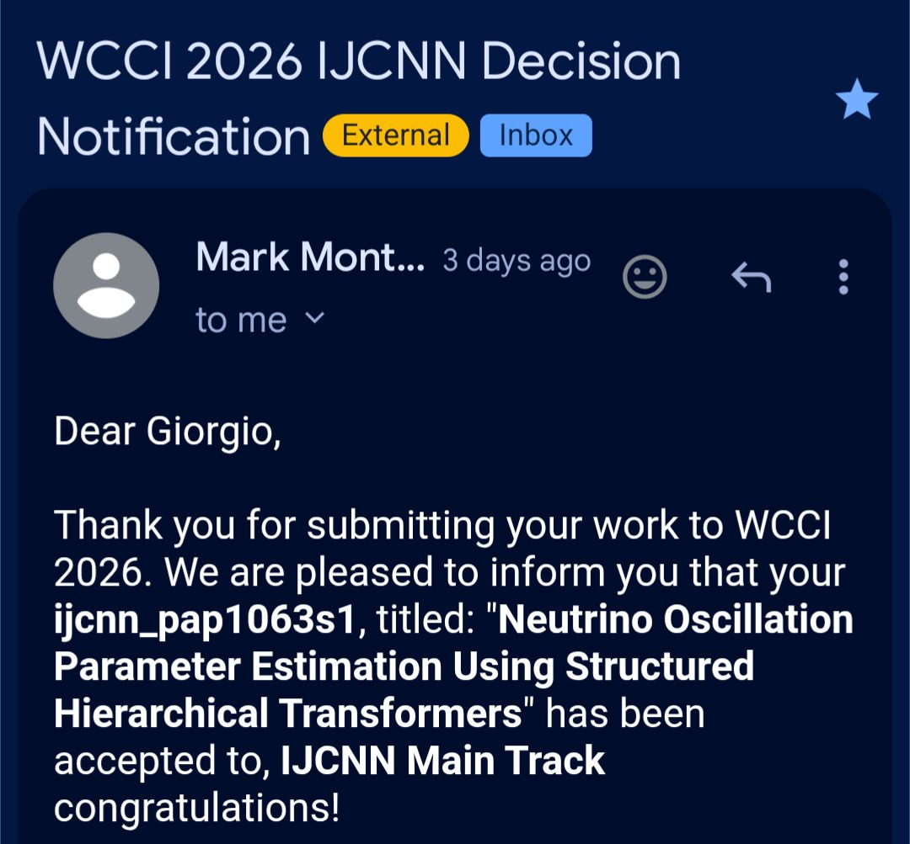

Last year, I learned a good deal about our ubiquitous little friends, the neutrinos. So, naturally, this is a 📢 Publication Alert! 

Our paper, "Neutrino Oscillation Parameter Estimation Using Structured Hierarchical Transformers," coauthored with [Gregory Lehaut](https://scholar.google.com/citations?user=mS3cu1AAAAAJ&hl=fr), [Antonin Vacheret](https://inspirehep.net/authors/1023486), [Frederic Jurie](https://frederic-jurie.github.io/), and [Jalal Fadili](https://fadili.users.greyc.fr/Pub/bibtex/consult.php), from [Greyc](https://www.greyc.fr/) and [LPC Caen](https://www.lpc-caen.in2p3.fr/), has been accepted at the International Joint Conference on Neural Networks (IJCNN). This year, it is part of the [World Congress on Computational Intelligence (IEEE WCCI 2026)](https://attend.ieee.org/wcci-2026/), to be held in Maastricht, Netherlands, June 21-26, 2026. 🇳🇱

🔬 Key Insights:
- We introduce a data-driven framework that reformulates atmospheric neutrino oscillation parameter inference as a supervised regression task over structured oscillation maps. 📊
- We also introduce a neural network-based uncertainty quantification mechanism, Conformal DualAQD, that produces distribution-free prediction intervals with formal coverage guarantees. 🛡️
- Experiments on simulated oscillation maps under Earth-matter conditions demonstrate that the proposed method is comparable to an MCMC baseline in estimation accuracy, with substantial improvements in computational cost (around 240× fewer FLOPs and 33× faster in average processing time). ⚡

📖 Read the full paper here: https://arxiv.org/abs/2603.22342

💻 GitHub repo here: https://github.com/GiorgioMorales/NuOscParam

    

