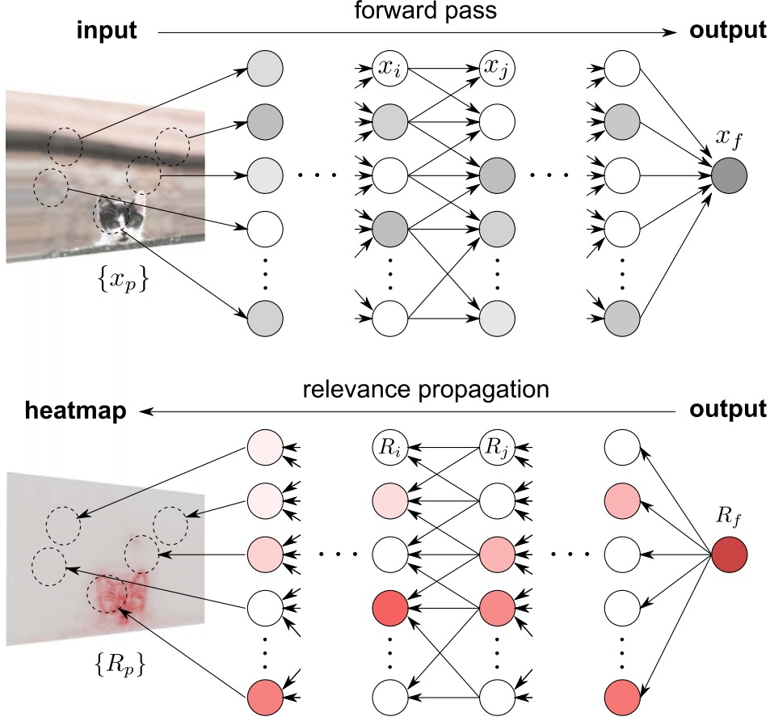
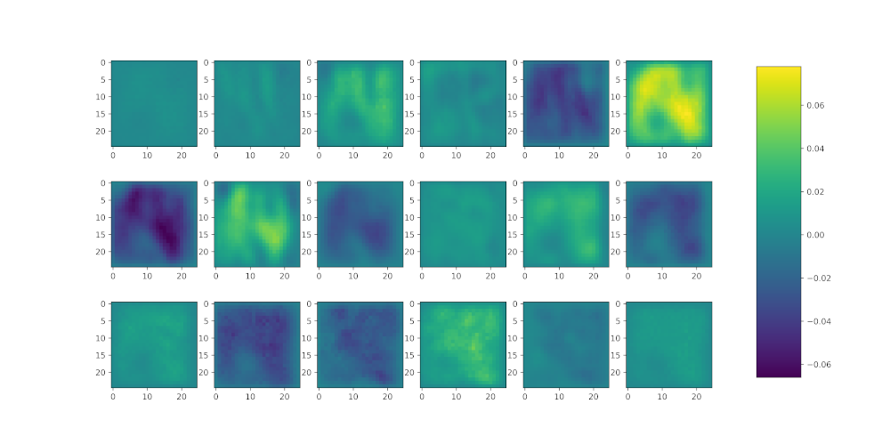

Being able to interpret a classifier's decision has become crucial lately. This ability allows us not only to ensure that a Convolutional Neural Network -for example- has learned the patterns that we expected, but also to discover patterns that were not obvious at first glance. Most of the works related to Layer-wise Relevance Propagation (LRP) so far have been applied to image classification tasks; in that case, we are interested in finding the pixel positions that were more relevant for a given classification result. For example, the following image highlights the most relevant pixels to obtain a prediction of the class "cat":

<div style="display: flex; justify-content: center;">
    
</div>

*Figure 1: Relevance is backpropagated from the top layer down to the input, where $\{R_p\}$ denotes the pixel-wise relevance scores, that can be visualized as a heatmap. Source: [Montavon et. al (2016)](https://doi.org/10.1016/j.patcog.2016.11.008)*
&nbsp;
&nbsp;

In the previous case, we know what kind of features define a cat, so we validate the resulting heatmap comparing it to our preconceived notions. What if we have a more complicated classification task that is not that easy for a human to interpret? In that case, we would like to use LRP the other way around; that is, to understand the local patterns that were more relevant to achieve a correct classification result. For instance, suppose that we gathered a great number of images of leaves with and without a certain disease, and we managed to train a Convolutional Neural Network  (CNN) that detects if a leaf is infected. Now, the users may not trust the magic 'black box' that is our CNN so we might use LRP as an option to explain what features among all the possible set of possibilities (e.g. coloration, holes, shapes) were the most relevant for our network when taking a decision. 

In this post, I will provide a specific example of the use of LRP applied to mutispectral images (MSI). To do this, we will use an [in-greenhouse dataset of hyperspectral images (HSI) of Kochia leaves](https://montana.box.com/v/kochiadataset) to classify the resistance level to two components commonly found in commercial herbicides in three categories: herbicide-susceptible, glyphosate-resistant, and dicamba-resistant. These HSI images contain 300 spectral bands (input channels). Even though if we select a reduced subset of important spectral bands (e.g. $10\sim20$), it is difficult for a human to identify what kind of information differentiates on class from the other. Therefore, we will use LRP not only to observe the most relevant pixel positions but also the most relevant spectral bands for a given classification; that is, instead of outputting one final heatmap (as shown in Fig. 1), we will get one heatmap per input channel.

## Reading the dataset

As stated before, we will use a hyperspectral image dataset, which means that each image (or "datacube") consists of several channels (or "spectral bands"). Specifically, the dimension of this dataset is of $25\times25\times300$. Luckily, I have nicely formatted the dataset as a ".h5" file so that we do not need to worry about reading complicated "tif" or "bip" formats. Furthermore, given that in a HSI datacube consecutive bands are very similar and that we do not need that level of detail, we will average pairs of consecutive pairs of bands in order to reduce the computational burden and use 150 bands instead of 300 (which is interpreted as reducing the spectral resolution from 2.12nm to 4.24nm).

```python
hdf5_file = h5py.File('weed_dataset_w25.hdf5', "r")
train_x = np.array(hdf5_file["train_img"][...]).astype(np.float32)
train_y = np.array(hdf5_file["train_labels"][...])
# Average consecutive pairs of bands
for n in range(0, train_x.shape[0]):
	img2[n, :, :, int(i / 2)] = (xt[:, :, i] + xt[:, :, i + 1]) / 2.
train_x = img2
# Reshape as a 4-D TENSOR (because we will use 3-D convolutions)
trainx = np.reshape(trainx, (trainx.shape[0], trainx.shape[1], trainx.shape[2], trainx.shape[3], 1))
# Permute according to Pytorch's order
trainx = trainx.transpose((0, 4, 3, 1, 2))
```

Finally, we will select a subset of 18 salient bands from the whole spectrum. How did we come up with these band indexes? I will probably explain it in a future post/paper. Stay tuned!

```python
indexes = [0, 1, 3, 11, 23, 33, 50, 68, 76, 82, 106, 128, 132, 136, 139, 143, 144, 146]
# Select bands from original image
temp = np.zeros((train_x.shape[0], train_x.shape[1], train_x.shape[2], nbands))
for nb in range(0, nbands):
	temp[:, :, :, nb] = train_x[:, :, :, indexes[nb]]
train_x = temp.astype(np.float32)
# Apply Band normalization (std = 1)
for n in range(train_x.shape[3]):
	train_x[:, :, :, n] = (train_x[:, :, :, n]) / 
    					  (np.std(train_x[:, :, :, n]))
```

Note that we are not working with normal RGB images and the range of values of each input channel is different, so we are transforming the data in a way that each channel has a standard deviation of 1. Furthermore, we want to make sure that all the input values are positive so that we can apply the same propagation rules we will apply to the following convolution layers (which we consider that will always receive positive values).   

## Network architecture

The network used in this work is called Hypr3DNetLite as it is proposed as a reduced version of the [Hyper3DNet network](https://doi.org/10.1117/1.JRS.14.036519), which is a 3D-2D CNN architecture specifically designed to solve HSI classification problems using a reduced number of trainable parameters. Here you have the network written in Pytorch. Note that every convolutional layer is followed by a ReLU rectifier and that I am not using Batch Normalization layers in order to ensure that every convolution layer outputs positive values.

```python
from abc import ABC

import torch.nn as nn
from torch import reshape


class Hyper3DNetLite(nn.Module, ABC):
    def __init__(self, img_shape=(1, 50, 25, 25), classes=2):
        super(Hyper3DNetLite, self).__init__()
        self.classes = classes
        self.img_shape = img_shape

        self.conv_layer1 = nn.Sequential(nn.Conv3d(in_channels=img_shape[0], out_channels=16, 
                                         kernel_size=3, padding=1), nn.ReLU())
        self.conv_layer2 = nn.Sequential(nn.Conv3d(in_channels=16, out_channels=16, 
                                         kernel_size=3, padding=1), nn.ReLU())
        self.sepconv1 = nn.Sequential(nn.Conv2d(in_channels=16 * img_shape[1],
                                         out_channels=16 * img_shape[1], kernel_size=5, 
                                         padding=2, groups=16 * img_shape[1]), nn.ReLU(),
                                         nn.Conv2d(in_channels=16 * img_shape[1], 
                                         out_channels=320, kernel_size=1, 
                                         padding=0), nn.ReLU())
        self.sepconv2 = nn.Sequential(nn.Conv2d(in_channels=320, out_channels=320, kernel_size=3,
                                         padding=1, stride=2, groups=320), nn.ReLU(),
                                      nn.Conv2d(in_channels=320, out_channels=256,
                                         kernel_size=1, padding=0), nn.ReLU())
        self.sepconv3 = nn.Sequential(nn.Conv2d(in_channels=256, out_channels=256, kernel_size=3,
                                         padding=1, stride=2, groups=256), nn.ReLU(),
                                      nn.Conv2d(in_channels=256, out_channels=256,
                                         kernel_size=1, padding=0), nn.ReLU())
        self.average = nn.AvgPool2d(kernel_size=7)

        if classes == 2:
            self.fc1 = nn.Linear(256, 1)
        else:
            self.fc1 = nn.Linear(256, self.classes)

    def forward(self, x):

        # 3D Feature extractor
        x = self.conv_layer1(x)
        x = self.conv_layer2(x)
        # Reshape 3D-2D
        x = reshape(x, (x.shape[0], self.img_shape[1] * 16, self.img_shape[2], self.img_shape[3]))
        # 2D Spatial encoder
        x = self.sepconv1(x)
        x = self.sepconv2(x)
        x = self.sepconv3(x)
        # Global Average Pooling
        x = self.average(x)
        x = reshape(x, (x.shape[0], x.shape[1]))
        if self.classes == 2:
            x = self.fc1(x)
        else:
            x = self.fc1(x)
        return x
```

Here you have a summary of the network architecture:

```python
----------------------------------------------------------------
        Layer (type)               Output Shape         Param #
================================================================
            Conv3d-1        [-1, 16, 6, 25, 25]             448
              ReLU-2        [-1, 16, 6, 25, 25]               0
            Conv3d-3        [-1, 16, 6, 25, 25]           6,928
              ReLU-4        [-1, 16, 6, 25, 25]               0
            Conv2d-5           [-1, 96, 25, 25]           2,496
              ReLU-6           [-1, 96, 25, 25]               0
            Conv2d-7          [-1, 320, 25, 25]          31,040
              ReLU-8          [-1, 320, 25, 25]               0
            Conv2d-9          [-1, 320, 13, 13]           3,200
             ReLU-10          [-1, 320, 13, 13]               0
           Conv2d-11          [-1, 256, 13, 13]          82,176
             ReLU-12          [-1, 256, 13, 13]               0
           Conv2d-13            [-1, 256, 7, 7]           2,560
             ReLU-14            [-1, 256, 7, 7]               0
           Conv2d-15            [-1, 256, 7, 7]          65,792
             ReLU-16            [-1, 256, 7, 7]               0
        AvgPool2d-17            [-1, 256, 1, 1]               0
           Linear-18                    [-1, 3]             771
================================================================
Total params: 195,411
Trainable params: 195,411
Non-trainable params: 0
```

## LRP function

Now we are ready to start writing our LRP function. It will take as arguments the trained model (here I'm assuming that we already trained the network), the individual datacube we want to analyze, and a string that denotes the type of device we are using. This section is based on the [implementation](http://heatmapping.org/tutorial/) of the "Layer-Wise Relevance Propagation: An Overview" paper by [Montavon et. al (2019)](https://link.springer.com/chapter/10.1007%2F978-3-030-28954-6_10) with some modifications so that we can use our own Hyper3DNetLite network.

The first step is to extract the layers from our model. In the previous section, we used $\texttt{nn.Sequential}$ layers to combine the convolutional and ReLU layers, and to simplify the structure of the Hyper3DNetLite class; however, here we will only take into account those layers that have useful weights and biases, so we will ignore the $\texttt{nn.Sequential}$ modules. Once we extracted all the useful modules from our trained network, we will propagate the input data $X$ hrough the network as follows:

```python
def LRP_individual(model, X, device):
    # Get the list of layers of the network
    layers = [module for module in model.modules() if not isinstance(module, torch.nn.Sequential)][1:]
    # Propagate the input
    L = len(layers)
    A = [X] + [X] * L # Create a list to store the activation produced by each layer
    for layer in range(L):
        # After the 4th and 17th layers, we should reshape the tensor
        if layer == 4:
            A[layer] = reshape(A[layer], (A[layer].shape[0], A[layer].shape[2] * 16,
                                          A[layer].shape[3], A[layer].shape[4]))
        elif layer == 17:
            A[layer] = reshape(A[layer], (A[layer].shape[0], A[layer].shape[1]))

        A[layer + 1] = layers[layer].forward(A[layer])
```

Note that we are applying two reshaping operations before the 4th and 17th layers. This corresponds to the reshaping operation we applied in the $\texttt{Hyper3DNetLite.forward()}$ method of the previous section (this allows to reshape from 4-D to 3-D tensors, and from 3-D to 1-D tensors, respectively). 

Now we calculate the relevance of the last layer. We will do this by simply taking the greatest value of the last activation. In this example, we are working with a multi-class classification problem, so, taking in mind that the last fully-connected layer has as many neurons/units as classes we have, each value of the last activation vector is related to the confidence that the corresponding unit represents the correct class (e.g. if the resulting A[-1] vector has three elements and the second one is the greatest, it means that the network predicted that the input image corresponds to the second class). We will assume that the classification of the network is correct and we will mask the A[-1] vector conserving only the greatest value, as we will show below. The intuition behind this is that we will propagate the relevance backward asking "which parts of the image are responsible for the activation of the $i$-th output unit" or "which parts of the image are more relevant when the network classifies it as the $i$-th class". Therefore, continuing with our function we have:

```python
    # LRP_individual function continuation...
    # Get the relevance of the last layer using the highest classification score of the top layer
    T = A[-1].cpu().detach().numpy().tolist()[0]
    index = T.index(max(T))
    T = np.abs(np.array(T)) * 0
    T[index] = 1
    T = torch.FloatTensor(T)
    # Create the list of relevances with (L + 1) elements and assign the value of the last one 
    R = [None] * L + [(A[-1].cpu() * T).data + 1e-6]
```

The next step is to propagate the relevance distribution of our last layer through the network. Before doing it, let's discuss how to use the propagation rules. First, we should recall that the relevance is conservative, which means that the sum of values of the relevance matrix of a layer should be the same as that of the relevance matrix of the following layer: $\sum_j R_j = \sum_k R_k$, where $j$ represents the indexes of the neurons/units of the first layer and $k$ represents the indexes of the neurons/units of the following layer. Then, the relevance flow can be described by the following equation:

$$R_j = \sum_k \frac{z_{jk}}{\sum_j z_{jk}} R_k,$$ 

where $z_{jk}$ represents how much the neuron/unit $j$ contributed to make neuron/unit $k$ relevant. Considering that, in our network (where each convolution layer is followed by a ReLU rectifier), the relation between the activation of the units $j$ and $k$ of consecutive layers is as follows: $a_k = \texttt{max}(0, \sum_{0,j}a_jw_k)$, then we may consider that the relevance is distributed proportionally to the contribution of each input to the neuron activation as follows: 

$$R_j = \sum_k \frac{a_jw_{jk}}{\sum_{0,j} a_jw_{jk}} R_k.$$

The previous one is the most basic propagation rule known as the **LRP-0 rule**. We can express any propagation rule using the following generic expression:

$$R_j = \sum_k \frac{a_j \rho(w_{jk})}{\epsilon + \sum_{0,j} a_j\rho(w_{jk})} R_k,$$

where $\rho(\theta)$ is a function that transforms the weights and biases $\theta$ of the lower layer. Using this template, we are able to define other propagation rules that overcome the limitations of the LRP-0 rule (which are affected by noisy or contradictory decisions), such as the gamma rule (**LRP-$\gamma$**), where $\rho(\theta) = \theta + \gamma\theta^+$, and $\theta^+=\texttt{max}(0,\theta)$, so that the $\gamma$ parameter controls how much importance the positive contributions have. Just for simplicity, we will use LRP-0 for the last two layers and LRP-$\gamma$ for the rest of the network, as we are mainly interested in the positive contributions. In our case, we will consider $\gamma=0.25$. Also, we will add a small factor, $1e-09$, to the denominator in order to avoid numeric inconsistencies. 

Now we would like to effiiently implement the previous propagation generic rule and to do that we will use the method suggested by [Montavon et. al (2019)](https://link.springer.com/chapter/10.1007%2F978-3-030-28954-6_10). First, let us denote the denominator of the previous equation as $z_k$; then, the element-wise division of the relevance of the next layer and the denominator is noted as $s_k=R_k/z_k$. We could rewrite the equation of the generic rule as: 

$$R_j = a_j \sum_k \rho(w_{jk}) \cdot s_k,$$ 

Notice that in the case of CNNs, it is not convenient to express the last equation in terms of the weights $w_{jk}$ so, instead, we will use a gradient computation taking $s_k$ as a constant as follows:

$$R_j = a_j [\nabla\sum_k z_k(a) \cdot s_k]_{j},$$ 

Thus, we start propagating the relevance of the last layer:

```python
# LRP_individual function continuation...
    # Propagation procedure from the top-layer towards the lower layers
    for layer in range(0, L)[::-1]:
    
        if isinstance(layers[layer], torch.nn.Conv2d) or isinstance(layers[layer], torch.nn.Conv3d) \
                or isinstance(layers[layer], torch.nn.AvgPool2d) or isinstance(layers[layer], 							torch.nn.Linear):
            
            # Specifies the rho function that will be applied to the weights of the layer
            if 0 < layer <= 13:  # Gamma rule (LRP-gamma)
                rho = lambda p: p + 0.25 * p.clamp(min=0)
            else:  # Basic rule (LRP-0)
                rho = lambda p: p
    
            A[layer] = A[layer].data.requires_grad_(True)
            # Step 1: Transform the weights of the layer and executes a forward pass
            z = newlayer(layers[layer], rho).forward(A[layer]) + 1e-9
            # Step 2: Element-wise division between the relevance of the next layer and the denominator
            s = (R[layer + 1].to(device) / z).data
            # Step 3: Calculate the gradient and multiply it by the activation layer
            (z * s).sum().backward()
            c = A[layer].grad  										   
            R[layer] = (A[layer] * c).cpu().data  
            
            # Before going back, reshape the relevances of layers 4 and 17 back to their original form  
            if layer == 17:
                R[layer] = reshape(R[layer], (R[layer].shape[0], R[layer].shape[1], 1, 1))
            elif layer == 4:
                R[layer] = reshape(R[layer], (R[layer].shape[0], 16, int(R[layer].shape[1] / 16), 								   R[layer].shape[2], R[layer].shape[3]))
        else:
            R[layer] = R[layer + 1]
    
    # Return the relevance of the input layer
    return R[0]
    

def newlayer(layer, g):
    """Clone a layer and pass its parameters through the function g."""
    layer = copy.deepcopy(layer)
    layer.weight = torch.nn.Parameter(g(layer.weight))
    layer.bias = torch.nn.Parameter(g(layer.bias))
    return layer
```


## Running the Function

Now, we will load our trained model and will apply our LRP function to the first image of the dataset:

```python
# Create the model and load the weights 
model = Hyper3DNetLite(img_shape=(1, 18, 25, 25), classes=3)
model.load_state_dict(torch.load(filepath))

# Set the model in evaluation mode 
self.model.eval()
Rel = LRP(model, from_numpy(trainx[0]).float().to("cpu"), device="cpu")

# Plot the relevance for each channel
minv = np.min(np.min(np.min(R[0].data.numpy(), axis=3), axis=3), axis=2)  # Get the minimum relevance 
maxv = np.max(np.max(np.max(R[0].data.numpy(), axis=3), axis=3), axis=2)  # Get the maximum relevance
fig, axs = plt.subplots(3, 6)
count = 0
for i in range(3):
    for j in range(6):
        im = axs[i, j].imshow(Rel.data.numpy()[0, 0, count, :, :], vmin=minv, vmax=maxv)
        count += 1
fig.subplots_adjust(right=0.8)
cbar_ax = fig.add_axes([0.85, 0.15, 0.05, 0.7])
fig.colorbar(im, cax=cbar_ax)
```

The result is shown below:



As it can be seen, the 6th and 8th input channels (spectral bands 33 and 68, respectively) contain the most relevant pixels for the obtained classification result. One way to verify that the propagation is correct is to verify the conservative property; that is, $\sum_j R_j = \sum_k R_k$. For example we can use the debugger before going out the $\texttt{LRP\_individual}$ function and verify the sum of the relevance values of each of the layers:

```python
print(np.sum(R[18].data.numpy()))  # Sum of relevances of layer 19
print(np.sum(R[17].data.numpy()))  # Sum of relevances of layer 18
print(np.sum(R[15].data.numpy()))  # Sum of relevances of layer 16
print(np.sum(R[11].data.numpy()))  # Sum of relevances of layer 12
...
```

In reality, these values are not expected to be the same, due to the fact that we are altering the original weights using the LRP-$\gamma$ rule and that the derivation is not exact, but they should be very similar. 

