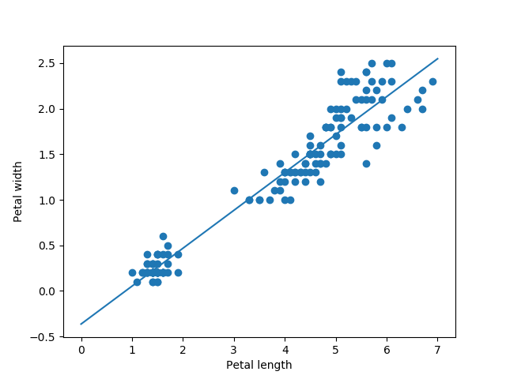

## 1. Introduction

Given a set of $n$ **independet variables**: $X_1, X_2, ..., X_n$ and a real-valued **dependant variable** $Y$ (or response variable), the goal of the linear regression problem is to find a **regression function** $f$ such that:

$$Y = f(X_1, X_2, ..., X_n) + \epsilon = f(X) + \epsilon$$

where $\epsilon$ is the error term, which is independent of $X$, and accounts for the uncertainty inherent in $Y$.

## 2. Linear Regression Model {#2-linear-regression-model}

The regression function $f$ can be expressed based on the multivariate
random variable $X$ and its parameters as follows:

$$ f(X) = \beta + \omega_1X_1 + \omega_2X_2 + \... + \omega_nX_n = \beta + \sum\_{i=1}\^{n}\omega_iX_i = \beta + \omega\^T X $$

where:

-   $\beta$: bias.
-   $\omega_i$: regression coefficient or weight for $X_i$.
-   $\omega = (\omega_1, \omega_2, ..., \omega_3)^T$ .

**Note:**

-   If $n=1$, $f$ represents a line with slope $\omega_i$ and offset
    $\beta$
-   In general: $f$ represents a hyperplane, $\omega$ is the vector
    notmal to the hyperplane and $\beta$ is the offset.

<div>

</div>

In practice, the parameters $\beta$ and $\omega$ are **unkown**, so the
idea is to estimate them from a training set $D$ consisting of $N$
points $x_i \in \mathbb{R}^n$. Let $b$ denote the estimated value of the
bias $\beta$, and $\texttt{w}=(w_1, w_2, ..., w_n)^T$ denote the
estimated value of the vector $\omega$; then, the estimated dependant
variable given a test point $\texttt{x}=(x_1, x_2, ..., x_n)^T$ can be
written as:

$\hat{y} = b + w_1x_1 + w_2x_2 + ... + w_nx_n = \beta + \texttt{w}^T \texttt{x}$$

## 2 Bivariate Regression {#2-bivariate-regression}

Let's consider the linear regression problem with only one attribute;
i.e., the dataset $D$ consists of points with only one dimension:

$$\hat{y}_i = f(x_i) = b + w \cdot x_i$$

The *residual error* between the estimated value $\hat{y}_i$ and the
actual observed response $y_i$ for of the $i$-th data point of $D$ is
expressed as:

$$\epsilon_i = y_i - \hat{y}_i$$

Since the objective is to minimize the error of our estimation, we can
use the *least squares* method to **minimize the sum of aqueared
errors**:

$$\min_{b, w} SSE = \sum_{i=1}^n \epsilon_i^2 = \sum_{i=1}^n (y_i - \hat{y}_i)^2 = \sum_{i=1}^n (y_i - b - w\cdot x_i)^2$$

In order to solve this objective, we differentiate it w.r.t $b$ and $w$,
and set the result to 0:

-   w.r.t. $b$:

$$\frac{\partial SSE}{\partial b} = 2 \sum_{i=1}^n (y_i - b - w\cdot x_i)\cdot 1 = 0$$

$$b = \frac{1}{n} \sum_{i=1}^n y_i - w \frac{1}{n} \sum_{i=1}^n x_i$$

$$b = \mu_Y - w \cdot \mu_X$$

-   w.r.t. $w$:

$$\frac{\partial SSE}{\partial b} = 2 \sum_{i=1}^n (y_i - b - w\cdot x_i)\cdot x_i = 0$$

$$\sum_{i=1}^n x_iy_i - (\mu_Y \sum_{i=1}^n x_i - w \cdot \mu_X \sum_{i=1}^n x_i) - w \sum_{i=1}^n x_i^2 = 0$$

$$\$w = \frac{\sum\_{i=1}\^n (x_i - \mu_X)(y_i - \mu_Y)}{\sum\_{i=1}\^n(x_i - \mu_X)\^2} = \frac{\sigma\_{XY}}{\sigma\_{X}\^2} $$

where $\sigma_{XY}$ is the covariance between $X$ and $Y$, and

## 2.1. Univariate Regression Example {#21-univariate-regression-example}

Since we just found a way to estimate the coefficients $w$ and $b$ for
the univariate regression problem, let's get our hands dirty with an
example.

For this, we will use the **Iris dataset**. Specifically, we will try to
estimate the width of the petal ($Y$) given only the length of the petal
($X$).

First, let's load the dataset:

``` python
import seaborn as sns
iris = sns.load_dataset('iris')
iris.head()
```

```{=html}
<div>
<style scoped>
    .dataframe tbody tr th:only-of-type {
        vertical-align: middle;
    }

    .dataframe tbody tr th {
        vertical-align: top;
    }

    .dataframe thead th {
        text-align: right;
    }
</style>
<table border="1" class="dataframe">
  <thead>
    <tr style="text-align: right;">
      <th></th>
      <th>sepal_length</th>
      <th>sepal_width</th>
      <th>petal_length</th>
      <th>petal_width</th>
      <th>species</th>
    </tr>
  </thead>
  <tbody>
    <tr>
      <th>0</th>
      <td>5.1</td>
      <td>3.5</td>
      <td>1.4</td>
      <td>0.2</td>
      <td>setosa</td>
    </tr>
    <tr>
      <th>1</th>
      <td>4.9</td>
      <td>3.0</td>
      <td>1.4</td>
      <td>0.2</td>
      <td>setosa</td>
    </tr>
    <tr>
      <th>2</th>
      <td>4.7</td>
      <td>3.2</td>
      <td>1.3</td>
      <td>0.2</td>
      <td>setosa</td>
    </tr>
    <tr>
      <th>3</th>
      <td>4.6</td>
      <td>3.1</td>
      <td>1.5</td>
      <td>0.2</td>
      <td>setosa</td>
    </tr>
    <tr>
      <th>4</th>
      <td>5.0</td>
      <td>3.6</td>
      <td>1.4</td>
      <td>0.2</td>
      <td>setosa</td>
    </tr>
  </tbody>
</table>
</div>
```

Now, we will separate the $X$ and $Y$ variables:

``` python
X = iris['petal_length']
Y = iris['petal_width']

print('Shape of the independent variable: ' + str(X.shape))
print('Shape of the dependant variable: ' + str(Y.shape))
```

```    
    Shape of the independent variable: (150,)
    Shape of the dependant variable: (150,)
```

For the sake of visualization, let's plot this set of points:

``` python
import matplotlib.pyplot as plt

plt.scatter(X, Y)
plt.xlabel("Petal length")
plt.ylabel("Petal width")
```

<div>

</div>

Now, let{s use the expressions for $w$ and $b$ that we found after least
squares minimizatoin:

$$b = \mu_Y - w \cdot \mu_X$$

$$w = \frac{\sigma\_{XY}}{\sigma\_{X}\^2} $$

``` python
import numpy as np

# Get number of samples
N = len(X)

# Calculate means
u_x = np.mean(X)
u_y = np.mean(Y)

# Calculate variance an covariance
varx = np.var(X)
varxy = np.sum((X - u_x) * (Y - u_y)) / N

# Calculate parameters
w = varxy / varx
b = u_y - w * u_x

print("Parameter w = " + str(w))
print("Parameter b = " + str(b))
```

```
    Parameter w = 0.41575541635241137
    Parameter b = -0.3630755213190291
```

Once that we obtained our estimated parameters, we can take any test
point and estimate its corresponding response variable. Thus, we will
plot the estimated petal widths for a range of petal length values
between 0 and 8.

``` python
# Range of petal lengths
xs = range(0, 8)

# Apply the linear regression model
ys = w * xs + b

# Plot the regression function
plt.scatter(X, Y)
plt.plot(xs, ys)
plt.xlabel("Petal length")
plt.ylabel("Petal width")

```

<div>
    
</div>

## 3 Multiple Regression {#3-multiple-regression}

Now we consider the case where each data point of the training set $D$
contains $n$ attributes:

$$\hat{y}_i = b + w_1x_{i1} + w_2x_{i2} + ... + w_nx_{in} = \beta + \texttt{w}^T \texttt{x}_i$$

Let $b=w_0$ and $x_{i0}=1$, then:

$$\hat{y}_i = w_0x_{i0} + w_1x_{i1} + w_2x_{i2} + ... + w_nx_{in} = \tilde{\texttt{w}}^T \tilde{\texttt{x}}_i$$

Since $i = 1, 2, 3, ..., N$, we can summarize the $N$ equations in just
one:

$$\hat{Y} = \tilde{D} \tilde{\texttt{w}}$$,

where $\hat{Y}=(\hat{y_1}, \hat{y_2}, ..., \hat{y_n})^T$ and $\tilde{D}$
is the augmented training data sample that includes the artificial
constant attribute $X_0$.

**Goal**: To find the best hyperplane defined by $\tilde{\texttt{w}}$
that minimizes the sum of squared errors:

$$\min_{\tilde{\texttt{w}}} SSE = \sum_{i=1}^n \epsilon_i^2 = ||Y - \hat{Y}||^2$$

$$=YY^T - 2Y\hat{Y} + \hat{Y}^T\hat{Y}$$

$$=YY^T - 2\tilde{\texttt{w}}(\tilde{D}^TY) + \tilde{\texttt{w}}^T(\tilde{D}^T\tilde{D})\tilde{\texttt{w}}$$.

Similar to what we have done previously, we need to differentiate $SSE$
w.r.t $\tilde{\texttt{w}}$ and set the result to 0:

$$\frac{\partial}{\partial \tilde{\texttt{w}}}SSE = - 2(\tilde{D}^TY) + 2(\tilde{D}^T\tilde{D})\tilde{\texttt{w}}= 0$$

$$\Rightarrow \tilde{\texttt{w}}= (\tilde{D}^T\tilde{D})^{-1}\tilde{D}^TY$$

let's replace $\tilde{\texttt{w}}$ in
$\hat{Y} = \tilde{D} \tilde{\texttt{w}}$:

$$\hat{Y} = \tilde{D}(\tilde{D}^T\tilde{D})^{-1}\tilde{D}^TY = H Y$$

## 3.1. Multivariate Regression: Example {#31-multivariate-regression-example}

This time we will use two independent variables from the Iris dataset:
Sepal length ($X_1$) and Petal length ($X_2$). Using these variables we
will estimate the response variable Petal width ($Y$).

``` python
X1 = iris['sepal_length']
X2 = iris['petal_length']
Y = iris['petal_width']

print('Shape of the first independent variable: ' + str(X1.shape))
print('Shape of the second independent variable: ' + str(X2.shape))
print('Shape of the dependant variable: ' + str(Y.shape))

# Plot the variables
fig = plt.figure()
ax = plt.axes(projection='3d')
ax.scatter3D(X1, X2, Y)
```

```
    Shape of the first independent variable: (150,)
    Shape of the second independent variable: (150,)
    Shape of the dependant variable: (150,)
```

<div>
    
</div>

We can construct now the augmented matrix $\tilde{D}$ including the
extra attribute $X_0$ as a column of $1$s:

``` python
# Create column of ones
Ones = np.ones((len(X1),))
# Stack the three columns to form Dtilde
Dt = np.vstack((Ones, X1, X2)).T
print("Showing the first 5 points of Dt:")
print(Dt[:5])
```

``` 
Showing the first 5 points of Dt:
    [[1.  5.1 1.4]
     [1.  4.9 1.4]
     [1.  4.7 1.3]
     [1.  4.6 1.5]
     [1.  5.  1.4]]
 ```


Having prepared our dataset, we can estimate the parameter vector using
the equation:
$\tilde{\texttt{w}}= (\tilde{D}^T\tilde{D})^{-1}\tilde{D}^TY$

``` python
# Calculate the regression coefficients
wt =  np.linalg.inv(Dt.T.dot(Dt)).dot(Dt.T.dot(Y))

print("Regression coefficients:")
print(wt)

# Print estimated response variable
Yt = Dt.dot(wt)
print("Printing the first 10 estimated values of Yt: ")
print(Yt[:10])
```

```
    Regression coefficients:
    [-0.00899597 -0.08221782  0.44937611]
    Printing the first 10 estimated values of Yt: 
    [0.2008197  0.21726327 0.18876922 0.28686622 0.20904148 0.31096719
     0.24192861 0.25397909 0.25837218 0.26220088]
 ```

Then, the fitted hyperplane can be expressed as:

$$\hat{Y} = -0.0089 - 0.082 X_1 + 0.449 X_2$$

Finally, let's plot the regression function:

``` python
# Range of petal and sepal lengths
X1s, X2s = np.meshgrid(range(10), range(10))

# Apply the linear regression model
ys = -0.0089 - 0.082 * X1s + 0.449 * X2s

# Plot the dataset and the hyperplane
fig = plt.figure()
ax = plt.axes(projection='3d')
ax.scatter3D(X1, X2, Y)
ax.plot_surface(X1s, X2s, ys, alpha=0.3)
ax.view_init(10,10)
```

<div>
    
</div>

## 3.2. Geometry of Multiple Regression {#32-geometry-of-multiple-regression}

What is the column space of a matrix?

Take the matrix
$A = \begin{bmatrix} 1 & 2 \ 0 & 3 \ 5 & 6 \ \end{bmatrix}$. The
column space of A is defined as the set of all possible linear
combinations of its column vectors; that is,
$col(A) = c_1 \begin{bmatrix} 1\ 0\ 5\ \end{bmatrix} + c_2 \begin{bmatrix} 2\ 3\ 6\ \end{bmatrix}$,
where $c_1$ and $c_2$ are scalars.

let's look at our linear regression model once again:

$$\hat{Y} = w_0X_0 + w_1X_1 + \... + w_nX_n $$.

Then, we can say that the predicted vector $\hat{Y}$ lies in the column
space of the augmented dataset
$\tilde{D} = \begin{bmatrix} | & | & ... & |\ X_0 & X_1 & ... & X_n\ | & | & ... & |\ \end{bmatrix}$

<div>

</div>

We want to minimize the residual vector error $\epsilon = Y - \hat{Y}$,
which is orthogonal to the column space $col(\tilde{D})$. Note that
$\epsilon$ is also orthogonal to each of the attributes $X_i$, so:

$$X_i^T\epsilon = 0$$

$$X_i^T(Y- \hat{Y}) = 0$$

$$w_0X_i^TX_0 + w_1X_i^TX_1 + ... + w_nX_i^TX_n = X_i^TY$$

This is called the **normal equation**. Given that we have ($d+1$)
independant variables and ($d+1$) unknown weights, the problem can be
solved.

We can put all the normal equations in a matrix form:

$$\begin{bmatrix} X_0^TX_0 & X_0^TX_1 & ... & X_0^TX_n\ X_1^TX_0 & X_1^TX_1 & ... & X_1^TX_n\ ... & ... & ... & ...\ X_n^TX_0 & X_n^TX_1 & ... & X_n^TX_n\ \end{bmatrix} \tilde{\texttt{w}} = \tilde{D}^TY$$

$$(\tilde{D}\^T\tilde{D})\tilde{\texttt{w}} =\tilde{D}\^TY \$$

$$\Rightarrow \tilde{\texttt{w}}= (\tilde{D}^T\tilde{D})^{-1}\tilde{D}^TY$$

## 3.3. QR-Factorization {#33-qr-factorization}

The attribute vectors are not necessarily orthogonoal. To obtain the
projected vector $\hat{Y}$ we need to construct and orthogonal basis for
$col(\tilde{D})$.

<div>

</div>


We can construct a set of orthogonal basis vectors $U_1, U_2, ..., U_n$
for $col(\tilde{D})$ using the *Gram-Schmidt orthogonalization* method:

$$ U_0 = X_0\$$

$$ U_1 = X_1 - p\_{10}\cdot U_0\$$

$$ U_2 = X_2 - p\_{20}\cdot U_0 - p\_{21}\cdot U_1\$$

$$\dots$$

$$U_d = X_n - p_{n0}\cdot U_0 - p_{n1}\cdot U_1 - ... - p_{n,n-1}\cdot U_{n-1}$$

where $p_{ji} = proj_{U_i}(X_j) = \frac{X_j^TU_i}{||U_i||^2}$ represents
the scalar projection of $X_j$ onto the basis vector $U_i$.

Now we can rearrange the previous set of equations:

$$ X_0 = U_0 $$

$$ X_1 = p\_{10}\cdot U_0 + U_1\$$

$$ X_2 = p\_{20}\cdot U_0 + p\_{21}\cdot U_1 + U_2\$$

$$\dots$$

$$X_d = p_{n0}\cdot U_0 + p_{n1}\cdot U_1 - ... + p_{n,n-1}\cdot U_{n-1} + U_n$$

We can also combine all the equations in a matrix form, such that:

$$\tilde{D}=QR$$,

where:

$$Q = \begin{bmatrix} | & | & ... & |\ U_0 & U_1 & ... & U_n\ | & | & ... & |\ \end{bmatrix}$$

and:

$$R = \begin{bmatrix} 1 & p_{10} & p_{20} & ... & p_{n0}\ 0 & 1 & p_{21} & ... & p_{n1}\ 0 & 0 & 1 & ... & p_{n2}\ ... & ... & ... & ... & ...\ 0 & 0 & 0 & ... & 1\ \end{bmatrix}$$

Finally, the estimated response variable $\hat{Y}$ can be expressed as
the sum of the projections of the observed response variable $Y$ onto
each one of the vectors of the new orthogonal basis:

$$Y = proj_{U_0}(Y)\cdot U_0 + proj_{U_1}(Y)\cdot U_1 + ... + proj_{U_n}(Y)\cdot U_n$$

## 3.4. Multiple Regression Algorithm {#34-multiple-regression-algorithm}

**Note:** (Squared norms)

$$Q^TQ = \Delta = \begin{bmatrix} ||U_0||^2 & 0 & 0 & ... & 0\ 0 & ||U_1||^2 & 0 & ... & 0\ 0 & 0 & ||U_2||^2 & ... & 0\ ... & ... & ... & ... & ...\ 0 & 0 & 0 & ... & ||U_n||^2\ \end{bmatrix}$$

In order to solve the regression problem, we can simply use the
expression we previously found and replace it using our new basis taking
into account that $\tilde{D} = QR$:

$$\tilde{\texttt{w}}= (\tilde{D}^T\tilde{D})^{-1}\tilde{D}^TY$$

$$R\tilde{\texttt{w}}= (\Delta)^{-1}Q^TY$$

Then, given that $\hat{Y} = \tilde{D} \tilde{\texttt{w}}$, we have:

$$\hat{Y} = Q((\Delta)^{-1}Q^TY)$$

Pseudocode:

    1. Dt <- (1  D)  # Augment the dataset
    2. {Q, R} = QR-factorization(Dt)
    3. Calculate Delta^-1
    4. Yt = Q (Delta^-1 . Q^T . Y)

## 3.5. Multiple Regression Algorithm: Example {#35-multiple-regression-algorithm-example}

let's repeat the same problem we saw before but now let's apply the
QR-factorization and geometric approach.

First, we will perform the QR-factorization using the `Dt` variable we
used before to store our augmented dataset.

``` python
# QR-factorization
Q, R = np.linalg.qr(Dt)

print('Shape of matrix Q: ' + str(Q.shape))
print('Shape of matrix R: ' + str(R.shape))
```

```
    Shape of matrix Q: (150, 3)
    Shape of matrix R: (3, 3)
```

Now we can calculate $\Delta$ using $Q$:

``` python
# Calculate Delta
Delta = Q.T.dot(Q)
print(Delta)
```

```
    [[ 1.00000000e+00 -2.16422835e-16  5.93091449e-17]
     [-2.16422835e-16  1.00000000e+00  1.75973941e-17]
     [ 5.93091449e-17  1.75973941e-17  1.00000000e+00]]
 ```


Finally, we have everything we need to use the equation
$\hat{Y} = Q((\Delta)^{-1}Q^TY)$:

``` python
# Estimated parameter vector
Yt = Q.dot(np.linalg.inv(Delta)).dot(Q.T.dot(Y))
print("Printing the first 10 estimated values of Yt: ")
print(Yt[:10])
```

```
    Printing the first 10 estimated values of Yt: 
    [0.2008197  0.21726327 0.18876922 0.28686622 0.20904148 0.31096719
     0.24192861 0.25397909 0.25837218 0.26220088]
 ```
