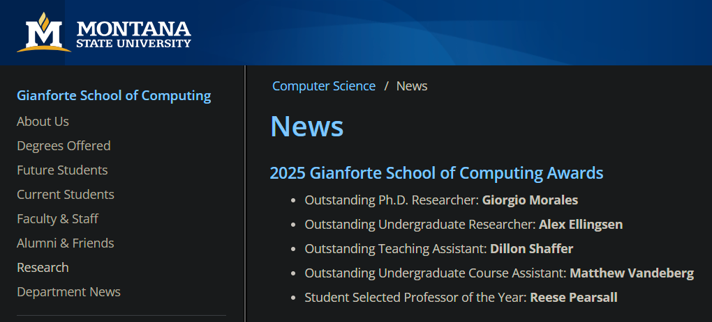

🌟 (More) Exciting News! 🌟

I'm honored to have received the **Outstanding PhD Researcher** award at the [2025 Gianforte School of Computing Awards](https://www.cs.montana.edu/news/current.html), 
held during the final session of the graduate seminar in the Computer Science Department at Montana State University.

    

Each year, the Gianforte School of Computing recognizes one PhD student for outstanding research 
contributions. 
I'm grateful to my advisor, **Dr. John Sheppard**, for nominating me and for kindly accepting the award on my behalf.
Here’s a video of him receiving it:


Thank to **Asad Noor** for recording it!