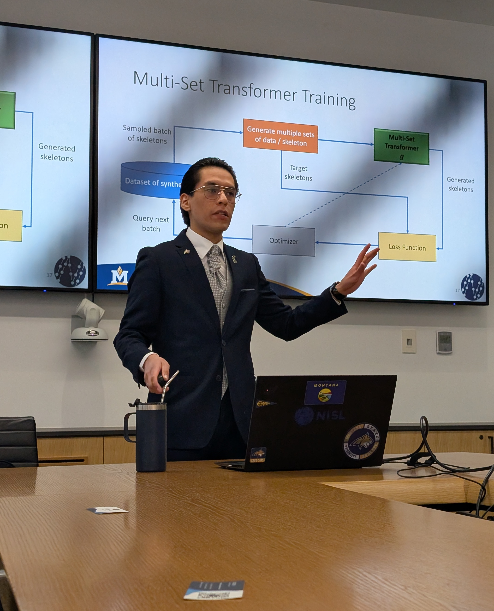

The PhD... what a humbling experience it was!

I successfully defended my PhD thesis today, titled "Decomposable Neuro Symbolic Regression with Uncertainty Awareness," 
and I was awarded the PhD degree in Computer Science from Montana State University-Bozeman. 
I cannot be more grateful to my wonderful advisor, Dr. John Sheppard, whose trust, support, and constant 
encouragement pushed me to grow and achieve much more than I thought I could! Thanks to the members of my 
PhD committee, Dr. Joseph Shaw, Dr. Sean Yaw, and Dr. Matt Revelle, for their valuable feedback and their 
thoughtful questions. 
They definitely got me thinking, and I’m sure their input will be super helpful for future work.

I also want to thank my amazing wife, Flor Vega-Castillo, for her love, inspiration, patience, and support 
throughout this journey. She helped me stay grounded, kept me going, and even made sure everything ran 
smoothly for the defense event, which wouldn’t have been the same without her. 
We both graduated this semester; she earned her Master’s in Public Administration 
(her first Master's was in Public Relations at Montana State University Billings), and I couldn’t be prouder of her. Sharing this milestone with her has made it all the more special.

To my wonderful parents, Sandra Luna Algazi and Jorge Morales De la Cruz I am forever grateful. They raised me to pursue my goals with determination and integrity, and their unconditional love and constant presence have been my greatest source of strength. Thanks to them, I’ve become the first PhD in our family. I know they’re proud of me, and I’m even more proud of them; this achievement belongs to all of us.

    

    

