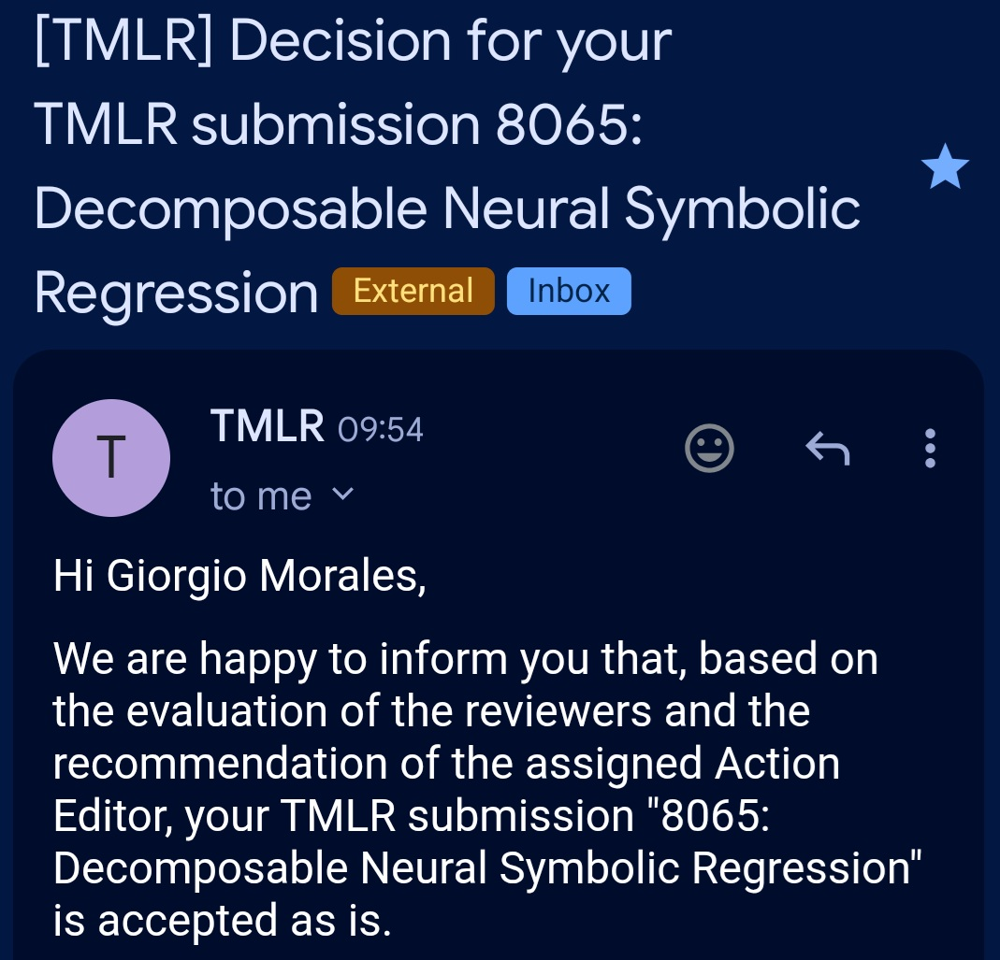
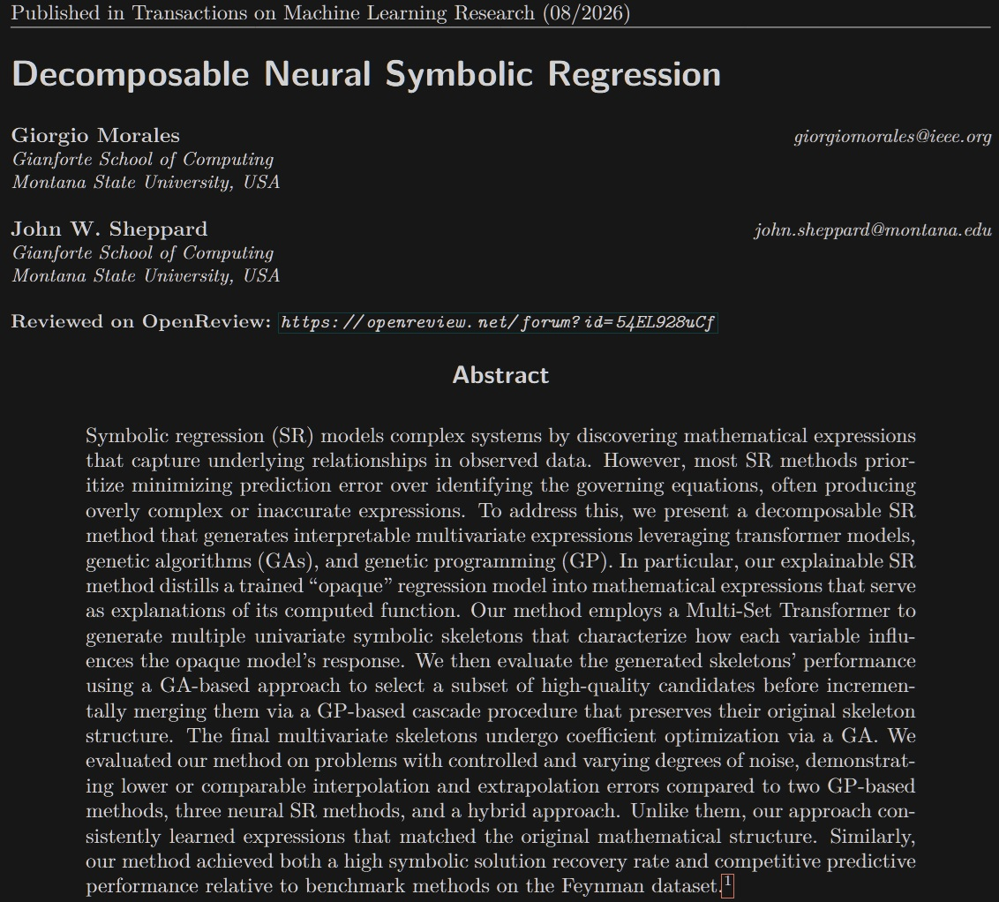

I am very proud to share that my first TMLR publication has officially been accepted as a long paper!

Our 48-page work ("long paper," alright), titled "[Decomposable Neural Symbolic Regression](publication/morales-2025-decomposableneurosymbolicregression/)", coauthored with Dr. [John Sheppard](https://www.cs.montana.edu/sheppard/), has been accepted for publication in [Transactions on Machine Learning Research (TMLR)](https://jmlr.org/tmlr/). This constitutes the core contribution of my PhD dissertation and marks the final piece of my PhD work from [Montana State University-Bozeman](https://www.cs.montana.edu/) to finally escape the review queue.

We present an explainable symbolic regression (SR) method that distills a trained "opaque'' regression model (e.g., a neural network) into mathematical expressions that serve as explanations of its computed function. Unlike most SR methods, which prioritize minimizing prediction error over identifying the governing equations, often producing overly complex or inaccurate expressions, we present a decomposable SR method that generates interpretable multivariate expressions leveraging a Multi-Set Transformer model, genetic algorithms, and genetic programming. 

📄 Read the [paper](https://giorgiomorales.github.io/publication/morales-2025-decomposableneurosymbolicregression/)
💻 Read the [code](https://github.com/NISL-MSU/MultiSetSR)

<figure style="display: flex; flex-direction: column; align-items: center;">
    
    <figcaption style="text-align: center; margin-top: 5px; font-style: italic;">
        TMLR Acceptance.
    </figcaption>
</figure>

<figure style="display: flex; flex-direction: column; align-items: center;">
    
    <figcaption style="text-align: center; margin-top: 5px; font-style: italic;">
        TMLR Abstract.
    </figcaption>
</figure>
