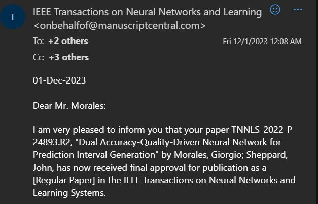

I am proud to announce that we got a journal paper accepted at the prestigious 
[IEEE Transactions on Neural Networks and Learning Systems](https://cis.ieee.org/publications/t-neural-networks-and-learning-systems) (Q1, IF: 10.4, h5-index=145). 
The paper is titled ["Dual Accuracy-Quality-Driven Neural Network for Prediction Interval Generation"](/publication/morales-dual-2023)
and was co-authored with Dr. John Sheppard. It presents a method to learn prediction intervals for 
regression-based neural networks automatically.

    

